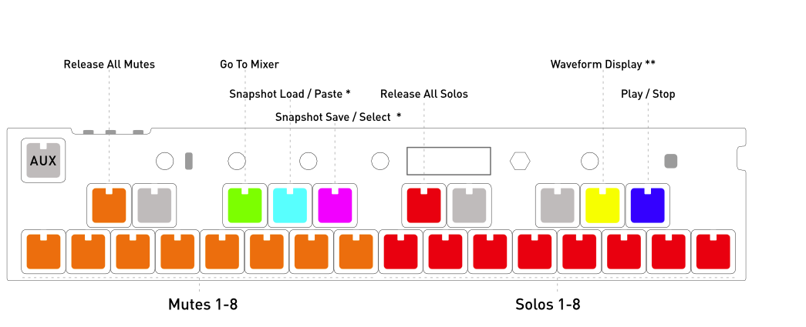

# OMX-27 Documentation

# Table of contents
1. [Concepts](#concepts)
   1. [Layout](#layout)
   2. [Encoder](#encoder)
   3. [AUX Key](#auxkey)
   4. [Potentiometers](#potentiometers)
   5. [Key Switches](#keyswitches)
   6. [Changing Modes](#changingmodes)
   7. [Sub-Modes](#subparagraph1)
   8. [Saving Session State](#savingsess)
2. [Modes](#modes)
   1. [MI - Midi Keyboard](#mimode)
   2. [DRUM - Drum Keyboard](#drummode)
   3. [CH - Chord Keyboard](#chordsmode)
   4. [S1 - Sequencer 1](#s1mode)
   5. [S2 - Sequencer 2](#s2mode)
   6. [GR - Grids Sequencer](#gridsmode)
   7. [EL - Euclidean Sequencer](#elmode)
   8. [OM - Organelle Mother](#organellemode)
   9. [Screensaver](#screensaver)
3. [Hardware](#hardware)

# Concepts <a name="concepts"></a>

OMX-27 is a MIDI Keyboard and Sequencer. Both USBMIDI (in/out) and hardware MIDI out (via 1.8" TRS jack) are supported. Various "modes" can be accessed with the encoder and specific functions, parameters or sub-modes can be accessed with the encoder or key-presses/key-combinations.

Sequencer modes have 8 patterns (tracks). Sequencer modes currently send MIDI clock and transport control (start/stop) by default.

CV pitch output is limited to about 4.3 octaves.

USBMIDI should be plug-and-play with any USBMIDI compatible host. iPad works great with the camera connection kit or a [lightning to usb micro cable](https://www.amazon.com/gp/product/B09KLXNYHL). Hardware MIDI TRS output jack is switchable between Type-A and Type-B.

## Layout <a name="layout"></a>


## Encoder <a name="encoder"></a>

The encoder is the knob directly to the right of the display.

You can use the encoder to modify parameters and change the selected parameter and page. 

Short press the encoder once to toggle between selecting parameters and editing them. The selected parameter will be highlighted to reflect which mode you are in. 

Long press the encoder to change to a different mode. Once in mode selection, turn the encoder, then short-press to enter the selected mode.

## AUX Key <a name="auxkey"></a>

The top left key is the AUX Key. 

In the MIDI Keyboard and Chords modes, holding this key gives you access to shortcuts. 

In the sequencer modes, this key is a dedicated start stop button. 

This key is also used in many places to quickly edit a parameter. To do this, hold down aux and turn the encoder to quickly edit the selected parameter without needing to press the encoder. If the encoder was already pressed, it is locked in edit mode and the aux shortcut won't work until you exit by pressing the encoder again.

If you are in a submode, the AUX Key can be used to exit out to the main mode. 

## Potentiometers <a name="potentiometers"></a>

The OMX-27 has 5 potentiometers which are mapped to send continuous controller MIDI messages (CCs). There are 5 banks of CCs available. You can switch banks using the PBNK parameter in the MI and DRUM Modes. 

Bank A is selected by default with the CCs set to controller numbers 21, 22, 23, 24 and 7 (volume). 

The CC's can also be reconfigured on device in the [CC Config page](#ccconfig), which is found on the last page of the MI Mode parameters. You can also configure the CC banks all at once via the [web configurator](https://okyeron.github.io/OMX-27/webconfig/index.html).

## Key Switches <a name="keyswitches"></a>

The functions of the key switches changes depending on which mode you are in. 

In MI Mode, the key switches work like a normal MIDI keyboard. 

In other modes, the keys have specific functions depending on the mode or submode. Most key interactions should also light up that key's LED.

In this documentation keys will be referred to by number, from left to right and position, top or bottom. Mentions of "White" or "Black" keys are in reference to a standard piano keyboard layout.

### "Black keys" (sharp/flat keyboard keys)

The top row (black) keys are referenced as **Top 1-10**.

The first 2 black keys are Function Keys (FUNC)
- F1 - First black key
- F2 - Second black key

FUNC keys are used to perform various shortcuts depending on the mode. 

The other black key functions depend on the current mode.

### "White keys" (bottom row)

The bottom row (white) keys are referenced as **Bottom 1-16**.

These have different functions depending on the current mode. For example, in sequencer modes, these are the sequencer step on/off keys.

## Changing Modes <a name="changingmodes"></a>

The OMX-27 has multiple modes. Each is independent - only one mode can be used at a time. 

Long press the encoder to change modes. 

## Sub-Modes <a name="submodes"></a>

Certain actions will cause you to enter a sub-mode, some examples could be editing MidiFX, configuring the pots, or saving/loading presets. If you are in a sub-mode, the AUX key will typically be flashing or red. A quick press of the AUX key will exit the sub-mode. 

## Macro-Modes <a name="macromodes"></a>

Macro modes are like sub-modes in that they are an alternate mode. Macro-modes can take over the keys, display, encoder, and pots. 

Macro modes are specialized modes designed to be used to control external gear like the M8, Norns, and Deluge. 

You can enter and exit macro modes by double clicking the AUX key in the root level mode. 

Learn more about macro modes [here](#mimacromodes)


## Saving Session State <a name="savingsess"></a>

To save your current session to memory, first enter Mode Select by holding the encoder. While this is active press AUX to save. 

The next time you restart your device, your last active mode will be loaded, and saved patterns and settings will be recalled. 

Saving is a long operation and not recommended to do while in the middle of a performance. 

---

# Modes <a name="modes"></a>

The OMX-27 has multiple modes. Each is independent - only one mode can be used at a time. 

Long press the encoder to change modes. 

The current modes are:  
- [MI - Midi Keyboard](#mimode)
- [DRUM - Drum Keyboard](#drummode)
- [CH - Chords](#chordsmode)
- [S1](#s1mode) - A step sequencer with 8 patterns that can be up to 64 steps. Only one pattern can be active at a time  
- [S2](#s2mode) - The same as S1 but all 8 patterns are active  
- [GR - Grids Sequencer](#gridsmode) (A rhythm sequencer based on Mutable Instruments Grids)  
- [EL - Euclidean Sequencer](#elmode)
- [OM - Organelle Mother](#organellemode)

## MI - MIDI <a name="mimode"></a>

MIDI Keyboard. This mode makes the 26 keys act like a normal musical keyboard on a chromatic scale. 

### AUX Key: 

The top left key standing by it's lonesome is the AUX Key. While holding down this key, the other 26 keys will no longer play musical notes and instead give you access to quick shortcuts. 

Holding the AUX key will let you quickly edit the selected parameter. To do this, hold down aux and turn the encoder to quickly edit the selected parameter without needing to click the encoder. If the encoder was already clicked, it is locked in edit mode and the aux shortcut won't work until you exit by pressing the encoder again.

If you are in a submode like editing midi fx or the arp, the AUX Key can be used to exit out to the main mode. 

### KEYS & LEDS

Each of the 26 keys will play a note on the chromatic scale. The keys will light up when pressed. They will also light up to show incoming midi notes. 

If a scale is enabled, the keys that are in the scale will be lit up. 

### KEYS & LEDS - AUX Button Held

Hold down the AUX key to access quick functions. 

#### Top Keys
- **[1] Previous Parameter** : Selects the previous parameter in the menu
- **[2] Next Parameter** : Selects the next parameter in the menu

##### MidiFX
Select which midifx slot to send the keyboard notes to.
Double click or long hold a MidiFX key to enter the MidiFX sub-mode and edit the effects.
See [MidiFX](#midifx) for more info. 

- **[5] MidiFX Off** : Notes from the drum key will be sent directly out
- **[6] MidiFX 1**
- **[7] MidiFX 2**
- **[8] MidiFX 3**
- **[9] MidiFX 4**
- **[10] MidiFX 5**

#### Bottom Keys
##### The Highest Highs and Lowest Lows
- **[1] Octave Down**
- **[2] Octave Up**

##### Arpeggiator
- **[12] Edit Params** : Enters a pass through arp edit sub-mode allowing you to edit arp values and also play the keyboard. You can also edit the arp in the MidiFX sub-mode but will need to exit the sub-mode to play the keyboard.
- **[13] Change Pattern** : Cycles through arpeggiator patterns  
- **[14] Change Octave** : Cycles through arpeggiator octave ranges  
- **[15] Toggle Hold** : Toggles the arpeggiator hold function  
- **[16] Power** : Toggles the arpeggiator on and off  

### Menu Pages

**Page 1 - Midi Out:**
- `OCT`: Current Octave  
- `CH`: Active MIDI Channel 
- `VEL`: The velocity level for midi notes 

**Page 2 - Inspect:**
Not editable, this shows which notes and CC's have been sent. 
- `P CC` : Pot CC, this is the CC number of the last pot that was used. 
- `P Val` : This is that last CC value of the last pot that was used. 
- `NOTE` : This is the number of the last note that was sent. Note that notes generated by MidiFX will not be seen here. 
- `VEL` : This is the velocity of the last note that was sent. 

**Page 3 - Midi Tools:**
- `RR`: RoundRobin MIDI Channel distribution
- `RROF`: RR offset value   
- `PGM`: MIDI program change  
- `BNK`: MIDI bank select.

**Page 4 - Pots & Macros:**
- `PBNK`: Potentiometer bank select
- `THRU`: When "On" incoming USBMIDI is passed to TRS MIDI Out.
- `MCRO`: MIDI Macro Mode Select (default is OFF)
- `M-CH`: MIDI Macro Mode Channel

**Page 5 - Scales:**
- `ROOT` : Select the root note for scale mode
- `SCALE` : Select a scale or turn off scale mode
- `LOCK` : Locks to the active scale. If this is enabled, you can only play notes in the scale
- `GROUP` : Groups all the notes of the scale across the lower row of 16 keys. 

**Page 6 - Config:**
- `CC` : Function, press down on the encoder to use. This enters the configuration tool for setting up the CC values for each pot bank.

### Musical Scales

Scales can be turned on using the 5th parameter page. When a scale is enabled, the keys in the scale light up, and the root notes light up a brighter color. You can still play chromatically and out of key. 

Enabling the 'LOCK' param makes it so only the notes in the scale send midi notes out. 

Turning on the 'GROUP' parameter maps the scale across the lower row of 16 keys. The root note starts on bottom key 2 which would normally be a C in chromatic mode. 

These scale settings also control the scale of the Scaler MidiFX when they are set to use the global scale. 

### CC Configuration Submode <a name="ccconfig"></a>

This mode lets you change the CC values that the potentiometers send out. 

Bottom Keys 1-5 let you quickly change the selected bank.  

Press the AUX key to exit. 

### MidiFX <a name="midifx"></a>

MidiFX are effects that can be applied after midi data is generated by playing keys or a sequencer and before any midi data goes out of the device. 

MidiFX can currently only be used within the: MIDI Keyboard (MI), Chords (CH) and Euclidian (EL) modes.

MidiFX currently only work on internally generated midi, but may support external midi coming in from USB in the future. 

MidiFX are arranged in groups of 8 MidiFX. A group of 8 is called a MidiFX Group. In the MI Mode, midi notes generated by playing the keyboard can only be routed to one MidiFX Group. In the sequencer modes, midi notes can be routed to different MidiFX groups by track. 

Think of a MidiFX group as a pedalboard for Midi. Midi data comes in from the left and go to MidiFX slot 1, then out of slot 1 to slot 2, until slot 8, then out of the device. 

You can change the active MidiFX group in the MI Mode and the Chords modes by holding aux and pressing one of the Top Keys 6-10. 

To enter the MidiFX submode, hold AUX, then hold or double click on a MidiFX Key(Top Keys 6-10). 

Top Key 1: Copy  
Top Key 2: Paste  
Top Key 1 + 2: Cut  
Top Keys 3 - 10: Select a MidiFX slot  
Bottom Keys: Add or change the type of MidiFX for a slot. You must hold down the MidiFX slot key in order to change.   

To move a MidiFX slot around, you can either cut and paste, or you can hold a MidiFX slot key and turn the encoder.  

There are several different MidiFX available for each slot. Select a MidiFX slot, and you can edit the parameters for that instance of a MidiFX.  

Each MidiFX type has a chance parameter. If this is less than 100%, than there is a chance this effect will not be applied.  

Available MidiFX:  
- Chance: Uses randomness to determine if a note passes through: 100% or gets killed: 0%  
- Transpose: Transpose midi notes by semitones or octaves  
- Randomizer: Randomize notes by range, octaves, velocities, and note lengths.  
- Harmonizer: Generate multiple notes from a single note. Great for 1 key chords, or to randomly play chords by setting it's chance parameter to less than 100%  
- Scaler: This forces notes into a specific scale.  
   - By default this uses the global scale. Modifying the root and scale pattern parameters changes the global scale.   
   - You can turn 'GLBL' to off to make this MidiFX instance use it's own unique root and scale pattern.   
- Make Mono: This forces polyphonic midi notes into monophonic.   
- Arpeggiator: This is an advanced arpeggiator. An arpeggiator MidiFX is automatically  added to a MidiFX group if you use any of the arpeggiator AUX quick keys.  
   - Try combining the arpeggiator with other MidiFX either before or after the arpeggiator for interesting effects.  
   - Arpeggiators are reasonably resource intensive, try to avoid using more than 3 of them in a MidiFX group for optimal performance.  

### Arpeggiator <a name="arp"></a>

The arpeggiator is an advanced arpeggiator with many different combinations of patterns, Mod Patterns, and Transpose patterns. 

The arpeggiator is actually a MidiFX and is only available in the modes that support MidiFX: MIDI Keyboard (MI), Chords (CH), and Euclidian Sequencer (EL).

In MIDI Keyboard and Chords modes, holding AUX allows you to quickly change basic settings of the arpeggiator. In order to access the more advanced functionalities, you need to access the arpeggiator parameters by either entering the MidiFX Group submode or by accessing the Arpeggiator pass-through mode by using AUX + Bottom Key 12.

The arpeggiator sends clock when in use.

#### Arp Menu Pages:

**Page 1 - Arp Settings 1:**
- `MODE`: Arpeggiator mode: On, 1-Shot, Once, Hold  
- `PAT`: The pattern of the arpeggiator  
- `RSET`: Determines what will cause the arpeggiator to reset  
- `CHC%`: How likely an incoming note will be used with the arpeggiator. Try playing with in the euclidean sequencer mode  

**Page 2 - Arp Settings 2:**
- `RATE`: How fast the arpeggiator plays  
- `RANG`: How many octaves to advance through  
- `GATE`: How long a note coming out of the arpeggiator is  
- `BPM`: Controls the master tempo  

**Page 3 - Arp Settings 3:**
- `ODIST`: How many semitones to consider an octave. Set to -12 to make the arpeggiator go downwards. Set to a semitone offset if you like to get weird  

**Page 4 - Inspect:**
These are not modifyable  
- `VEL` : Velocity based on first notes that turn on the arp  
- `CHAN` : First note that starts the arp sets the channel  
- `MIDI` : If midi data is output
- `CV` : If CV data is output  

**Page 5 - Mod Pattern:**
- Each of the 16 steps can be used to modify the arp pattern in various ways  

**Page 6 - Transpose Pattern:**
- Each of the 16 steps can be used to transpose notes in semitones 
- Recommend trying to use for some cool one key bass patterns  


### MIDI Macro Modes <a name="mimacromodes"></a>

Midi macro modes are specialized Midi controller modes designed to be used with specific hardware that can be controlled via Midi. 

If a midi macro is selected, you can double click the AUX key to enter the midi macro mode, and double click the AUX key to exit the macro mode.

Midi macro modes send control midi commands on the Midi Macro channel, which is `M-CH` in the parameters.

Macro modes are supported in the MI and DRUM modes. 


#### M8 Macro Mode

From MI Mode, be sure `M8` is selected from the `MCRO` parameter and then double click the AUX button to enter Macro Mode.

`M-CH` should be set to the same value as the Control Map Channel in the M8 MIDI settings screen. Default is set to channel 10.  

Double click the AUX button again to exit Macro Mode.

The M8 macro mode has two pages, which change what the Keys do.

* Mute Solo Page:

The bottom row of keys correspond to mutes (orange) and solos (red). The top "black keys" are as follows:  

```
Orange - release all mutes  
Lime - go to mixer screen  
Cyan - snapshot load/paste *   
Magenta - snapshot save/enter selection mode *  
Red - release all solos  
Yellow - waveform display  
Blue - play  
```


When M8 is selected from the `MCRO` parameter - potentiometers send on the `M-CH` MIDI channel in both regular keyboard mode and in the macro mode. However, notes played on keys send on the currently selected `CH` MIDI channel.

**Notes:**
* M8 must be on the Mixer view for snapshots.  
* Snapshot Load uses the M8 key combo [SHIFT]+[OPTION]. On any view with a grid (song, chain, phrase, table, etc.) this key enters selection mode.  
* Snapshot Save uses the M8 key combo [SHIFT]+[EDIT]. On any view with a grid this key pastes the copied contents from selection mode.  

* Control Page:

This page lets you navigate the M8 using the keys on the device instead of the keys on the M8.

Top Key 1 and Bottoms Keys 1-3: These correspond to the directional arrow keys. 

Top Key 4: Option Key
Top Key 5: Edit Key
Bottom Key 6: Shift Key
Bottom Key 7: Play Key

The right half of the Keyboard is a 1-octave midi keyboard that sends notes on the same midi channel as when not in macro mode. 

#### Norns Macro Mode

The Norns macro mode gives you the ability to control the Monome Norns using the OMX-27. In this mode, you can control the three buttons and three encoders using the OMX-27. This is useful if your norns is not located close by and you would like to control it.

Find the `MCRO` parameter in the menu and select `NRN` to enable the Norns Macro mode. 

Double click the AUX button to enter Macro Mode. Double click the AUX button again to exit Macro Mode.

##### Norns Setup
In order for this to work, you will need to setup the [qremote mod](#https://llllllll.co/t/qremote/57549) on your norns. 

Obtain the mod here: https://llllllll.co/t/qremote/57549

or install in Maiden
`;install https://github.com/Quixotic7/qremote`

Enable the mod in the mod menu of norns, connect your OMX-27 to the norns and restart. The easiest way to connect the OMX-27 is to simply use a USB port on the norns. 

The qremote mod will default to using midi channel 10. If you are using defaults, make sure your OMX-27 Macro Channel `M-Chan` is set to 10. 

Use the default configuration for encoders and buttons:

The default cc’s for the encoders are 58, 62, & 63

The default cc’s for the buttons are 85, 87, & 88

You can change these in the parameter menu. Or edit the script to change the defaults.


##### Norns Buttons
These act the same as if pressing the buttons on the Norns.
- **[Top 3] B1**
- **[Bot 4] B2**
- **[Bot 5] B3**

##### Norns Encoders
Use the OMX-27 Encoder to control one of the Norn's encoders. Since the OMX-27 only has one encoder, shortcut keys are used to determine which encoder will be controlled.
- **[Top 5] Enc 1**
- **[Bot 6] Enc 2**
- **[Bot 7] Enc 3**

##### Norns Navigation
The keys of the OMX-27 are used to emulate up/down left/right keys useful for menu navigation. These work by controlling encoder 1 or encoder 2, sending one tick either clockwise or counter-clockwise. 
- **[Top 1] Up**
- **[Bot 1] Left**
- **[Bot 2] Down**
- **[Bot 3] Right**


#### Deluge Macro Mode

The latest Deluge Community Firmware has added a new feature called Midi-Follow. 

https://github.com/SynthstromAudible/DelugeFirmware/blob/community/docs/features/midi_follow_mode.md

This mode provides default CC mappings to control many of the synth parameters with a midi controller and to be able to play the active instrument without needing to midi learn everything. 

This Macro Mode provides parameter banks to control every available parameter on the Deluge using the 5 pots of the OMX-27. The Deluge will also send back the values of the parameters to the OMX-27 which will update the values in each bank on the OMX-27. This will only work if you are connected via USB as the OMX-27 does not have TRS Midi-in. Values are updated when changing them from the gold knobs, or from edit view, when entering a clip view, or when changing a synth or kit.

##### Deluge Setup

Download and install the latest Deluge Nightly Firmware: https://github.com/SynthstromAudible/DelugeFirmware/releases . This Midi-Follow feature is not included in the 1.0.1 release. There is also a new beta build released which should have the feature, but it is not confirmed. 

To install the FW, place the `.bin` file on your sd card, ensuring there are no other `.bin` files. Carefully reinsert the SD Card in the Deluge, if it is misangled it can fall into the device. Turn on the Deluge while holding the shift key. 

Hold Shift + Click the main Select Knob, find Midi, click the Select Knob, find "MIDI-FOLLOW", click the select Knob, find "CHANNEL", click the select Knob, set each channel to something, I recommend channel 10. Also from the "MIDI-FOLLOW" level, select "FEEDBACK" and set the channel to 10 as well. 

For further help see https://github.com/SynthstromAudible/DelugeFirmware/blob/community/docs/features/midi_follow_mode.md 

##### OMX Setup

Find the `MCRO` parameter in the menu and select `DEL` to enable the Deluge Macro mode. Change Macro Channel `M-CH` to 10 or whatever you set your Deluge to.

Double click the AUX button to enter Macro Mode. Double click the AUX button again to exit Macro Mode.

##### KEYS & LEDS
The keyboard is split into two halves. 

The right octave of the keyboard works the same as the midi keyboard from MI Mode and will inherit it's settings. 

The left half of the keyboard is dedicated to selecting different banks of parameters. 

Some keys will have multiple banks assigned to them, to access the other banks, click the key a second time. 

- **[Top 1] Env 1**
- **[Top 2] Env 2**
- **[Top 3] LPF**
- **[Top 4] HPF**
- **[Top 5] EQ**
- **[Bot 1] Master**
- **[Bot 2] OSC 1**
- **[Bot 2] FM 1** : Click the key a second time
- **[Bot 3] OSC 2**
- **[Bot 3] FM 2** : Click the key a second time
- **[Bot 4] LFO Delay Reverb**
- **[Bot 4] ModFX** : Click the key a second time
- **[Bot 5] Distortion Noise**
- **[Bot 6] Arp Sidechain**
- **[Bot 7] Custom 1** : Bank of 5 parameters you can midi learn to whatever
- **[Bot 7] Custom 2** : Click the key a second time

##### KEYS & LEDS - AUX Button Held

###### Select a parameter
This will select a parameter. If you click the encoder to enter edit mode the encoder can be used to change the value without needing to pickup the pot. 
- **[Top 1] Param 1**
- **[Top 2] Param 2**
- **[Top 3] Param 3**
- **[Top 4] Param 4**
- **[Top 5] Param 5**


###### Change octave
This effects the keyboard on the right half.
- **[Bot 1] Octave Down**
- **[Bot 2] Octave Up**

###### Lock the AUX View
This locks the AUX view, allowing you to use the AUX shortcuts without holding down the AUX key. To unlock, use the AUX button again or press the lock AUX key. 
- **[Bot 4] Lock AUX**

###### Revert Values
This will revert the values of the current bank to their previous state. The previous state is saved whenever the bank is changed, or when the values are updated from incoming Midi from the Deluge. This is fun to play with with the effects, crank up the bitcrush, delay, or reverb temporally, then press this button to revert it back to what it previously was. 
- **[Bot 8] Revert Bank**


##### POT Pickups
Depending on which bank is selected, the OMX-27 will send out different CC's for each of the 5 potentiometers. When a change is detected on a pot, the screen will update to show the name of the current bank, parameter, and value that is being sent. 

In the MI and Drum modes, the pot values that are sent jump to the current position of the pot. In the Deluge Macro, you will need to pickup the value before it is sent. The small triangle on the screen represents the current raw value of the pot, the horizontal bar represents the value for that parameter. You will need to turn the knob left or right to pickup the value. 

The Deluge can also be setup to pickup, however this macro will work best if the Deluge is set to jump. 

##### Encoder
The encoder can be used to send out values without needing it to be picked up. To edit a parameter, click the encoder, then turn. There is not currently a visual representation to provide feedback for this. If you click the encoder again, you can scroll to change which parameter in the bank to control. You can also use the AUX shortcuts to quickly jump to parameters, or lightly wiggle a knob. 

---

## DRUM - Drum Keyboard <a name="drummode"></a>

This mode shares a lot in common with the MI mode. The main difference is that instead of each key being a key on a chromatic keyboard, each of the 26 keyboard keys can be assigned to send out a unique note, velocity, and midi channel. This is useful if you want to use the OMX to play an external drum machine or samples, or multiple drum machines on different  midi channels, or for any purpose you'd like really, feel free to get creative!

The grouping of 26 keys is called a "Drum Kit" and you can store up to 8 different drum kits on the OMX. 

Press any key to play it. A note on will be sent when pushed and a note off will be sent once released. 

**Selected Drum Key** - This is the last key that was pressed down, it is visually represented by a flashing LED.

The first two pages on the OMX display can be used to change the settings for the selected drum key. Each key can be configured to send a unique note number, velocity, midi channel, and be routed to one of the 5 MidiFX slots. Yes, you can use multiple MidiFX at once. You could have one drum key be routed to MidiFX 1 which has an arp to play a bassline, another key could go to MidiFX 2 with a different arp to play a melody, then another key could be setup to play a kick drum which is routed to MidiFX 3 which has a randomizer enabled to randomly vary the velocity each time it is played. Go wild, get creative, there are no bounds, welcome to OMX!

### Menu Pages
**Page 1 - DrumKey 1:**
Values apply to the selected drum key
- `NOTE` : Midi note number that the drum key will send
- `CH` : Midi Channel that the drum key will send
- `VEL` : Velocity of the note the drum key sends
- `FX#` : Number of the MidiFX slot that the note is sent to

**Page 2 - DrumKey 2:**
- `HUE` : Changes the color of the selected drum key
- `HUE RND` : Function, press down on the encoder to use. This will randomize all the hues in the current drum kit.

**Page 3 - Scales:**
This changes the current scale settings. While a scale won't normally apply to the drum kit, the scale settings are shared globally with the MidiFX. So if you are using a scale MidiFX, this makes it easy to change up the scale without needing to edit the MidiFX. 
- `ROOT` : Root note of the scale. 
- `SCALE` : Which scale to use.
- `LOCK` : Only notes in the scale can be played, has no effect on the drum kit keys. 
- `GROUP` : Groups the notes in keyboard view accross the lower keys, no effect on the drum kit keys. 

**Page 4 - Inspect:**
Not editable, this shows which notes and CC's have been sent. 
- `P CC` : Pot CC, this is the CC number of the last pot that was used. 
- `P Val` : This is that last CC value of the last pot that was used. 
- `NOTE` : This is the number of the last note that was sent. Note that notes generated by MidiFX will not be seen here. 
- `VEL` : This is the velocity of the last note that was sent. 

**Page 5 - Pots & Macros:**
Settings for the potbank, midi, and macro modes. 
- `PBNK` : Pot Bank - Determines which potbank is active. 
- `THRU` : Midi Thru - If this is on, incoming midi from USB will be sent out the TRS midi jack. 
- `MCRO` : Macro - Determines which macro is active. Macros can be entered by double clicking the AUX key. 
- `M-CH` : Macro channel - Determines which midi channel is used by the macro. 

**Page 6 - Config**
- `CC CFG` : Function, press down on the encoder to use. This enters the configuration tool for setting up the CC values for each pot bank.

### KEYS & LEDS - Main Screen
Each key represents a drum pad in your drum kit. 

Pressing a key will send a note on. Releasing it will send a note off. Which note is sent for each key can be configured by pressing the key, then editing it's varaibles in page 1 and 2 of the menu.

The flashing key is the Selected Drum Key. 

Each key can be any color determine by the HUE variable of each drum key. 

### KEYS & LEDS - AUX Button Held
Hold down the AUX key to access quick functions. 

#### Top Keys
- **[1] Previous Parameter** : Selects the previous parameter in the menu
- **[2] Next Parameter** : Selects the next parameter in the menu

##### saving and loading drum kits
- **[3] Load Kit** : Use this to load a kit
- **[4] Save Kit** : Use this to save a kit

##### MidiFX
Unlike the MI Keyboard mode, the midifx slot only applys to the selected drum key.
See MidiFX for more info. 
- **[5] MidiFX Off** : Notes from the drum key will be sent directly out
- **[6] MidiFX 1**
- **[7] MidiFX 2**
- **[8] MidiFX 3**
- **[9] MidiFX 4**
- **[10] MidiFX 5**

#### Bottom Keys
##### Quickly switch kits
- **[1] Load Prev Kit** : Loads the next kit out of 8, any changes to the current kit will be autosaved
- **[2] Load Next Kit** : Loads the previous kit out of 8, any changes to the current kit will be autosaved

##### Arpeggiator
- **[12] Edit Params** : Enters a pass through arp edit sub-mode allowing you to edit arp values and also play the keyboard. You can also edit the arp in the MidiFX sub-mode but will need to exit the sub-mode to play the keyboard.
- **[13] Change Pattern** : Cycles through arpeggiator patterns  
- **[14] Change Octave** : Cycles through arpeggiator octave ranges  
- **[15] Toggle Hold** : Toggles the arpeggiator hold function  
- **[16] Power** : Toggles the arpeggiator on and off  

### Potentiometers


---

## CH - Chords <a name="chordsmode"></a>

Ever wanted to play insanely complex chords with the click of a button? Well now you can! In Chord mode, the bottom 16 keys can each be assigned to play a unique chord. 

### UI Views

There are two UI views: "Split" and "Full". This can be changed on page 2. By default, the UI layout is in "Split Mode" meaning the right half of the keyboard works like a 1 octave keyboard and the left half will give you 8 chords that can be played. In "Full" mode, each of the 16 bottom keys will play chords.

### Key Modes

There are several different modes available which can be switched using the top keys 3, 4, & 5.

- **[Top 3] Play Mode**
- **[Top 4] Edit Mode**
- **[Top 5] Strum Mode**

#### Play Mode
- **[Top 3] Play Mode**

This mode is where you want to be if you would like to play chords and the keyboard(Split UI Mode) at the same time. Switching to this mode will bring the menu to the first page, displaying a keyboard that shows the notes of the last chord key that was pressed. You can still edit chords through the menu by switching pages.

#### Edit Mode
- **[Top 4] Edit Mode**

This mode is for editing the available chords and will bring the menu to the chord edit page. 

When in the edit mode and in the "Split" UI view, you can hold down a chord key on the left half and press a key on the right half to set the root note for basic chords. For interval chords, the right half will not change anything. 

The first two top keys, key 1 and key 2 act as function keys F1 and F2 in this mode.

- **[Top 1 - F1] Edit Chord** : Holding F1 and pressing a chord key will enter a edit chord submode.   
- **[Top 2 - F2] Copy Chord** : Holding F2 and pressing a chord key will save the selected chord to the newly selected chord slot. 

#### Strum Mode
- **[Top 5] Strum Mode**

This mode allows you to strum chords using the encoder. The UI view will change to "Full" in this mode. 

To use this mode hold down a chord key and turn the encoder CW or CCW. Only the last pressed chord will be strummed. Multiple chords will not be strummed. 

##### Strum Pot Parameters. 
In strum mode, the 5 pots are used to change the behaviour of the strum. 

- **[Pot 1] Sens - Sensitivity** : This determines how much the encoder needs to be turned to trigger a new note
- **[Pot 2] Wrap** : If this is off, the chord can be strummed once, if this is on, the chord will wrap back to the beginning like an arpeggio. 
- **[Pot 3] Increment / Octave** : This is only valid if Wrap is on. If it is, each time the chord wraps the notes will increase by an octave. This value determines how many octaves will be added before resetting. 
- **[Pot 4] Sustain** : This value determines how long each strum note will be played for. 
- **[Pot 5] Not Assigned**

### Chord Key Settings

A chord key is either bottom key 1-8 in "Split" UI mode or bottom key 1-16 in "Full" UI Mode. Pushing a chord key will play a chord, and releasing the key will stop playing the chord. Multiple Chord Keys can be pressed at once, and also combined with the 1 Octave midi keyboard on the right half in "Split" UI mode. 

Each chord key can have a unique chord type, velocity, midi channel, and be routed to one of 5 MidiFX(#midifx) slots. 

The last chord key that was pressed becomes the selected chord key. This is visually represented on the LEDs as that key will stay lit up

**Page 4 - Chord Key Settings:**<a name="chordkeysettings"></a>
These parameters apply to the selected chord key
- `TYPE` : Determines the chord type: Basic`BASC` or Interval`INTV`, see section below on chord types. 
- `MIFX` : Which [MidiFX](#midifx) will this chord be sent to? 
- `VEL` : Velocity of the notes in the chord
- `MCHAN` : Midi channel of the notes that this chord gets sent to

### Chord Types

Two types of chords are currently available: Basic and Interval. Basic chords don't have many settings and are quick to tweak. Interval chords have a lot more options and are linked to the current global musical scale. 

#### Basic Chords <a name="basicchords"></a>
These chords have no relation to the current global musical scale. 

All the parameters are shown on a single page that will show 4 ghosts. 

- `NOTE` : Determines the root note of the chord
- `OCTAVE NUMBER` : Determines the octave of the root note
- `GHOSTS` : The ghosts determine how the chord is voiced. Each ghost represents the order of the notes in the chord. The vertical position of a ghost determines the velocity of that notes. A large white ghost will play a note in the same octave as the root note. A large black ghost will play a note one octave below. A short white ghost will play a note one octave above. 
- `SCALE` : Determines the scale of the chord. The last scale is called "Custom" and will let you manually set the notes in the chord. 

##### Custom Chords
If `SCALE` is set to `Custom` an additional page in the menu will be revealed. In this page you can program up to 6 notes. 

The first 4 notes will be modified +- an octave, or turned off based on your `GHOST` settings

The value of each note in a custom chord is defined as a semitone from the root note of the chord. For a C Maj basic triad chord, you would set this to `RT +4 +7` . `RT` means root note. 

#### Interval Chords <a name="intervalchords"></a>
These chords are linked to the current global musical scale. If you play an interval chord and it does not sound good, start by seeing if you have a global scale enabled, and make sure it's not chromatic. 

##### Interval Menu Page 1
- `#NTS` - Number of notes : How many notes to play, 1 - 4
- `DEG` - Degree : Determines which degree of the the current global scale to start the chord on. If the global scale was C Maj, then Deg 0 would play a chord that starts on C, Deg 1 would play a chord that starts on D, Deg 6 would play a chord that starts on B. 
- `OCT` - Octave : The octave of the chord is determined by the global octave +- this value. 
- `TPS` - Transpose : This will transpose the chord by a seminote. Do note that if you transpose a interval chord it will no longer be in scale. 

##### Interval Menu Page 2
- `SPRD` - Spread : This determines how many octaves the chord is spread out across the keyboard. 
- `ROT` - Rotate : This rotates the notes of the chord. for a C Maj Triad, rot of 0 will play C E G, rot of 1 will make E the lowest note, playing E G C+1oct, rot of 2 will make G the lowest note
- `VOIC` - Voicing : Changes the voicing of the chord. Still stays in scale, but will shift notes or add additional notes. 

##### Interval Menu Page 3
- `UPDN` - Spread Up & Down : This will spread the notes out in a negative octave and positive octave. 
- `QRTV` - Quartal Harmony : This enables Quartal Harmony. I have no idea what this is doing music theory wise, but it sounds cool. Technically it's bumping the first note up two octaves, the third note up one octave, and the fourth note down 1 octave. It's supposed to separate the notes by 4ths. 

### Menu Pages

##### Menu Page 1 - Keyboard
This page will display a keyboard on the screen showing which notes are being played from the last chord key that was pressed. 

##### Menu Page 2 - Chord Mode Settings
- `UI` : Change the UI View from `SPLIT` or `FULL`. Split view adds a 1-octave midi keyboard on the right half of the keys. in Full view, all 16 of the bottom keys play chords.

##### Menu Page 3 - Keyboard Midi Settings
These settings apply to the 1-octave keyboard on the right side if the UI View is in `SPLIT` view. Each chord has unique settings.
- `OCT`: Current Octave. This value also changes the base octave used by interval chords
- `CH`: Active MIDI Channel 
- `VEL`: The velocity level for midi notes 

##### Menu Page 4 - Pots and Macros
- `PBNK`: Potentiometer bank select
- `THRU`: When "On" incoming USBMIDI is passed to TRS MIDI Out.
- `MCRO`: MIDI Macro Mode Select (default is OFF)
- `M-CH`: MIDI Macro Mode Channel

##### Menu Page 5 - Scale Settings
The scale settings apply to the 1-octave keyboard on the right side if the UI View is in `SPLIT` view and also will effect the interval chord keys. 
A scale should be set to something other than chromatic to get good results from interval chords. 
- `ROOT` : Select the root note for scale mode. This changes what note the interval chords will play. 
- `SCALE` : Select a scale or turn off scale mode
- `LOCK` : Locks to the active scale. If this is enabled, you can only play notes in the scale
- `GROUP` : Groups all the notes of the scale across the lower row of 16 keys. 

##### Menu Page 6 - Chord Key Settings
This changes the settings of the selected chord key. See [Chord Key Settings](#chordkeysettings)

##### Menu Page 7 - Basic or Interval Chord Key Settings
These pages will be different depending if the selected chord key is set to Basic or Interval.
See [Basic Chords](#basicchords) or [Interval Chords](#intervalchords)

### KEYS & LEDS - AUX Button Held
Hold down the AUX key to access quick functions. 

#### Top Keys
- **[1] Previous Parameter** : Selects the previous parameter in the menu
- **[2] Next Parameter** : Selects the next parameter in the menu

#### Saving and loading
- **[3] Load Bank**
- **[4] Save Bank**

##### MidiFX
This sets the MidiFX slot that either the keyboard in split UI view is being sent to, or the selected chord key is being sent to. Whichever key was last used determines this. You can also change the midifx slot a chord key is sent to from the menu, see [Chord Key Settings](#chordkeysettings)
Hold or double click a MidiFX key to enter the MidiFX submode. 
See [MidiFX](#midifx) for more info. 
- **[5] MidiFX Off**
- **[6] MidiFX 1**
- **[7] MidiFX 2**
- **[8] MidiFX 3**
- **[9] MidiFX 4**
- **[10] MidiFX 5**

#### Bottom Keys
##### Change Octave
This changes the global octave. This value will change the octave of the midi keyboard in split view and also change the base octave of interval chords.
- **[1] Prev Octave**
- **[2] Next Octave**

##### Arpeggiator
This effects the Arpeggiator on the currently selected MidiFX slot that the midi keyboard is being sent to.
- **[12] Edit Params** : Enters a pass through arp edit sub-mode allowing you to edit arp values and also play the keyboard. You can also edit the arp in the MidiFX sub-mode but will need to exit the sub-mode to play the keyboard.
- **[13] Change Pattern** : Cycles through arpeggiator patterns  
- **[14] Change Octave** : Cycles through arpeggiator octave ranges  
- **[15] Toggle Hold** : Toggles the arpeggiator hold function  
- **[16] Power** : Toggles the arpeggiator on and off  

### Saving and Loading
- **[AUX + Top 3] Load Bank**
- **[AUX + Top 4] Save Bank**

Use these shortcuts to save and load banks of chords. There are 8 available banks. If you load a bank other than the current one, the current bank will be autosaved. You can revert changes to your current bank by loading the same bank again. 

---

## S1 - Sequencer 1 <a name="s1mode"></a>

Step sequencer - One pattern active at a time.

Layout: 

### "Black keys" (sharp/flat keyboard keys)

The first 2 black keys are Function Keys (FUNC)
- F1 - First black key
- F2 - Second black key

The next 8 are Pattern Keys and they select the active sequence pattern (P1-P8).

Hold a key (long press) to access parameters for that pattern. This is "Pattern Params".


### "White keys" (bottom row)

Sequencer Step Keys - These are your sequencer step on/off keys.

Hold a key (long press) to access parameters for that step. This is "Note Select / Step Parameters". F1 + Step Key is also a quick shortcut.

Keys/Commands:   
 - AUX is Start/Stop  
 - Start/Stop sends MIDI transport control, and MIDI clock when running  
 - Pattern Key: Selects playing pattern  
 - F1 + AUX: Reset sequences to first/last step  
 - F2 + AUX: Reverse pattern direction  
 - F1 + Pattern Key: Enter __Step Record__ (transport must be stopped)  
 - F2 + Pattern Key: Mute that pattern  
 - F1 + Step Key: Enter __Note Select / Step Parameters__  
 - Long press a Step Key: Enter __Note Select / Step Parameters__   
 - Long press a Pattern Key: Enter __Pattern Parameters__  
 - AUX-key exits sub-modes  
 - Hold F1 + F2: first 4 "white keys" select "page" of the current pattern (depending on pattern length)  

Parameters:  
(see below) 


### Note Select / Step Parameters

Long press a step key to enter this mode. Here you can change the note values (note number, velocity, note length and octave), set CC parameter-lock values with the knobs, and set step parameters (step events, step probability, trig conditions).

While in Note Select, the rightmost and leftmost keys will blink (orange or blue)- these 2 keys will shift the current octave up or down.

Press AUX to exit Note Select.  

Parameters:  

Page 1:  
- `NOTE`: midi note number  
- `OCT`: octave  
- `VEL`: note velocity  
- `LEN`: note length in steps (1-16)   

Page 2:  
- `TYPE`: step event type (see below)  
- `PROB`: percentage of the step triggering  
- `COND`: trig conditions (see below)  

Page 3: (set CC parameter-locks)  
- `L-1`: pot 1 p-lock value for this step  
- `L-2`: pot 2 p-lock value for this step  
- `L-3`: pot 3 p-lock value for this step  
- `L-4`: pot 4 p-lock value for this step  

Touching any potentiometer while in Note Select will set that p-lock value.

To reset/erase a p-lock - Highlight the parameter and turn the encoder to the left.

#### Step Events (TYPE):
"-" mute
"+" play
"1" reset to first step
">>" set parttern direction forward
"<<" set parttern direction reverse
"#?" jump to random step number
"?" set random event (of any of the previous events) for that one step

#### Trig conditions - A/B Ratios (COND):__
Play that step on the A cycle of B total cycles (or bars) of the pattern. Default is 1:1 (every time).
First number - play step on that cycle thru the pattern
Second number - resets the counter after that pattern cycle.

So 1:4 would play on the first cycle, not play on the next three and then reset (after the 4th cycle). 3:8 would play only the 3rd cycle and reset after the 8th.

#### Step Record

(SH-101-ish style note entry)

Holding F1 + a Pattern Key will enter Step Record Mode.

Enter notes from the keyboard and the sequence step will automatically advance to the next step. Change knob 1-4 positions to set a CC parameter lock for that step. Knob #5 (far right) will enter a velocity value for that step (there is no visual feedback when entering values from the knobs.

If you want to skip steps while entering notes, use the encoder button to select the STEP parameter and rotate to the step you want to change/update. While a step is selected, you can also record plocks/velocity for that step with the knobs without changing the note value. 

There are two pages of parameters in Step Record. First is the current octave (OCT), step number (STEP), note-value (NOTE), and pattern number (PTN). Second shows the step event parameters TYPE, PROB and COND as described above.

Press AUX to exit Step Record.

Keys/Commands:  
- Potentiometers 1-4 set a CC parameter lock  
- Potentiometers 5 sets a step velocity   
- AUX exit this sub-mode  


### Pattern Parameters

Long press Pattern Key to enter Pattern Params Mode.

Turning the encoder will show different pages of parameters.

A short-press on the encoder will select the active parameter for editing. Press the encoder repeatedly until nothing is selected to change pages.

Press AUX to exit Pattern Parameters.

Parameters:  

Page 1:  
- `PTN`: selected pattern  
- `LEN`: pattern length  
- `ROT`: rotation  
- `CH`: midi channel   

Page 2 (see Sequence Reset Automation below):  
- `START`: steart  
- `END`: end  
- `FREQ`: frequency  
- `PROB`: probability   

Page 3:  
- `RATE`: default note length (1/64th to whole note)    
- `SOLO`: MIDI solo   

Keys/Commands: 
- Step Keys set pattern length  
- F1 + pattern copies pattern  
- F2 + pattern pastes pattern (to other pattern slot)  
- F1 + F2 + pattern clears the pattern back to GM drum map default (and clears all plocks)  

(you can paste multiple times - paste buffer should stay the same until you copy again)

MIDI solo:
Set a pattern to MIDI solo and you can play the keyboard while that pattern is selected.

Note - once in MIDI solo, you will only be able to change the active pattern by using the encoder knob.

### Pattern Parameters: Sequence Reset Automation

This is located on the second page of pattern parameters

The goal of this "Sequence Reset Automation" feature was developed in the spirit of classic sequencers that can generate more complex sequences from simpler ones by setting any step in a given sequence to trigger a "reset" based on some constraint (i.e., number of cycles, probability, random).

Note - This behavior is a pattern-based solution. You can also execute step-based resets in Step Parameters.

Settings:

- START (Currently 0 - PatternLength-1): Use this to set the start step in current pattern to reset to for beginning a new cycle.

- END (Currently 0 - PatternLength-1): Use this to set the last step in current sequence to end/reset pattern cycles. This in essence is the step that will be used to trigger resets.

- FREQ of trigger reset (i.e., every X sequence cycle iterations)

- PROB of triggering reset (percentage)

NOTE: Setting STEP = 0 and PROB = 1 dictates random trigger steps which can lead to interesting results by jumping to random position/step.

---

## S2 - Sequencer 2 <a name="s2mode"></a>

Step sequencer - All patterns active.

Keys/Commands:   
 - AUX is Start/Stop  
 - Start/Stop sends MIDI transport control, and MIDI clock when running  
 - Pattern Key: Selects active pattern  
 - Encoder changes "page" for sequence parameters (with no parameter highlighted)  
 - Short-press encoder to highlight active parameter to edit  
 - F1 + AUX: Reset sequences to first/last step  
 - F2 + AUX: Reverse pattern direction  
 - F1 + Pattern Key: Enter __Step Record__    
 - F2 + Pattern Key: Mute that pattern  
 - F1 + Step Key: Enter __Note Select / Step Parameters__  
 - Long press a Step Key: Enter __Note Select / Step Parameters__   
 - Long press a Pattern Key: Enter __Pattern Parameters__  
 - AUX-key exits sub-modes  
 - Hold F1 + F2: first 4 "white keys" select "page" of the current pattern (depending on pattern length)  

Parameters:  
- `PTN`: selected pattern  
- `TRSP`: transpose (by semitones)  
- `SWNG`: swing  
- `BPM`: tempo   

- `SOLO`: set the current pattern to MIDI Solo  
- `LEN`: pattern length  
- `RATE`: default note length (1/64th to whole note)  
- `CV`: enable to send CV from this pattern   


In the sequencer modes, the default setup is a GM Drum Map with each pattern on a consecutive midi channel. So that's notes 36, 38, 37, 39, 42, 46, 49, 51 on channels 1-8.

---

## GR - Grids Sequencer <a name="gridsmode"></a>

An adaptation of the Mutable Instruments "Topographic drum sequencer" module.

See the original [Grids Manual](https://mutable-instruments.net/modules/grids/manual/) [or a video ?] for more.

Grids is a 4-channel/instrument MIDI trigger generator specialized in the creation and sculpting of rhythmic patterns. The "grid" refers to a map or library of preset drum patterns arranged in a 5x5 grid - which you can steer using X/Y controls.

Typical drum use would be Bass Drum, Snare, Closed HiHat, Open HiHat (The default note numbers are mapped to these in the GM drum map).

### Quick Keys
Grids has many quick keys. Pressing these keys quickly jumps the display to select a specific parameter which can be adjusted with the encoder.

#### Keys/Commands:   
 - AUX is sequencer Start/Stop  
 - Pots 1-4 control "event density" (probability) of 4 instruments - values are shown on display  
 - Pot 5 sets resolution (1/2, 1, 2)
 - Bottom row keys 1-8 are quick-keys for X/Y values - hold a key and turn encoder to change that instrument's X or Y value. You can hold multiple keys to change X/Y on multiple instruments at the same time  
 - LEDs on Keys 9-12 show trigger activity of the playing pattern  
 - Lighted Keys 13,14,16 are quick keys for ACNT/XAOS/BPM
 - Pattern keys (black keys) can load "snapshots" of density/x/y settings
 - F2 + Pattern saves a "snapshot" current state of that pattern. Patterns do not automatically save, this is a performance feature, allowing you to load a pattern, tweak it, then quickly load back to it's original state  

#### Instrument View Mode:
- F1 + Keys 1-4 jump to Instrument View. This shows the current pattern on that instrument (over 2 pages since patterns are 32 steps) and playhead. The LED render of the pattern will update to show each page while playing   
- Top row lighted keys(A#1, C#2, D#2, F#2) are quick-keys for ACNT/X/Y/XAOS
- First 4 keys of bottom row will not be specially lit since they are rendering the pattern, but will allow you to quickly select a different instrument  
- F2 is a quick key to jump to params page to set Note Number, MIDI Channel and BPM  
- Key 3(F#1) in Instrument View is a quick key for Midi Channel for the instrument  
- AUX-key exits Instrument View 

#### Midi Keyboard Mode:
- F1 plus bottom key 16 enters into the Midi Keyboard for sending CCs or playing over the top of the sequencer. Everything works the same as mode MI  
- Hold Aux and bottom key 16 to exit out of the Midi Keyboard mode  

### Menu Pages
Page 1 Event Densities:
- `DS 1`: event density - instrument 1  
- `DS 2`: event density - instrument 2  
- `DS 3`: event density - instrument 3  
- `DS 4`: event density - instrument 4  

Page 2:
- `NT 1`: note number - instrument 1  
- `NT 2`: note number - instrument 2  
- `NT 3`: note number - instrument 3  
- `NT 4`: note number - instrument 4  

Page 3:
- `ACNT`: accent amount (larger number is more variation) - applies to all instruments   
- `X `: X amount for selected instrument  
- `Y `: Y amount for selected instrument  
- `XAOS`: chaos amount - applies to all instruments  

Page 4 - Main Mode:
- `BPM`: tempo  

Page 4 - Instrument View Active:
- `NT -`: note number for active instrument  
- `M-CHAN`: midi chanel for active instrument  
- `BPM`: tempo

---

## EL - Euclidian Sequencer <a name="elmode"></a>

---

## OM - Organelle Mother <a name="organellemode"></a>

Pretty much the same as MI, but with the following tweaks for Organelle Mother on norns/fates/raspberry-pi.

- AUX key sends CC 25 (127 on press, 0 on release)
- Encoder turn sends CC 28 (127 on CW, 0 on CCW)

---

## Screensaver <a name="screensaver"></a>
After a default timeout (3 minutes), the display will be blanked and in MI Mode a "screensaver" animation will show on the LEDs. The rightmost pot (#5) can be turned to adjust the color. Touching any keys or any of the other pots will exit the screensaver.  

In S1/S2 the screen will blank, but there is no LED animation.

---

# Hardware <a name="hardware"></a>

## MIDI Switch for the mini TRS output jack connection

A hardware switch on the device will let you swap between Type-A and Type-B for the hardware MIDI TRS output jack.

Products That Use Type-A mini TRS Jack Connections
- ADDAC System products
- Arturia BeatStep (not to be confused with the BeatStep Pro)
- Dirtywave M8
- IK Multimedia products
- inMusic (Akai) products
- Korg products
- Line 6 products
- little Bits w5 MIDI module
- Make Noise 0-Coast

Products That Use Type-B mini TRS Jack Connections
- Arturia BeatStep Pro
- Faderfox products
- Novation products
- Polyend products
- 1010music Original Series 1 modules, Series 2 modules, Blackbox, MX4 and Euroshield

See [https://minimidi.world](https://minimidi.world) or [https://1010music.com/stereo-minijacks-midi-connections-compatibility-guide](https://1010music.com/stereo-minijacks-midi-connections-compatibility-guide) for more information

