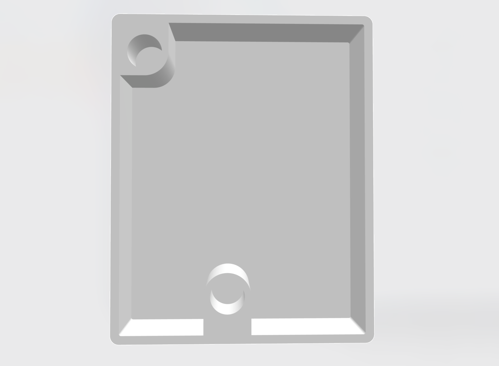
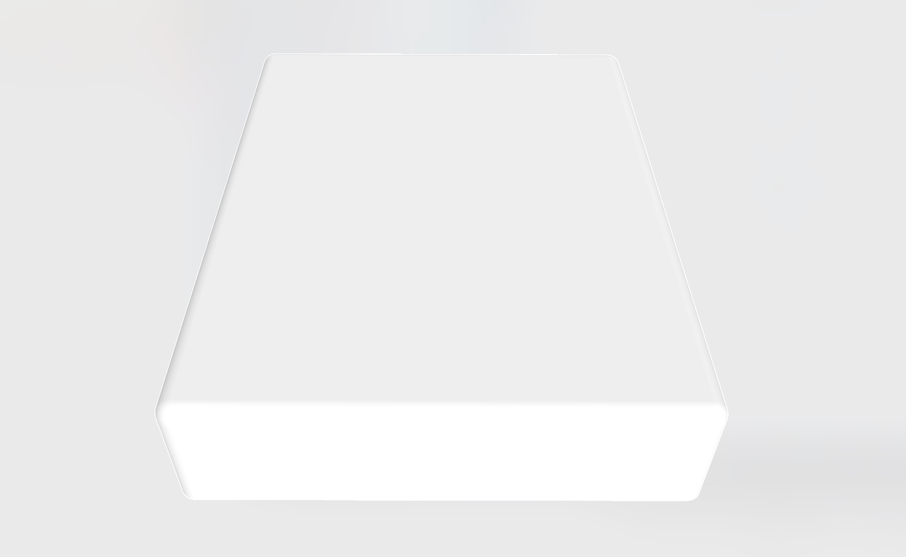
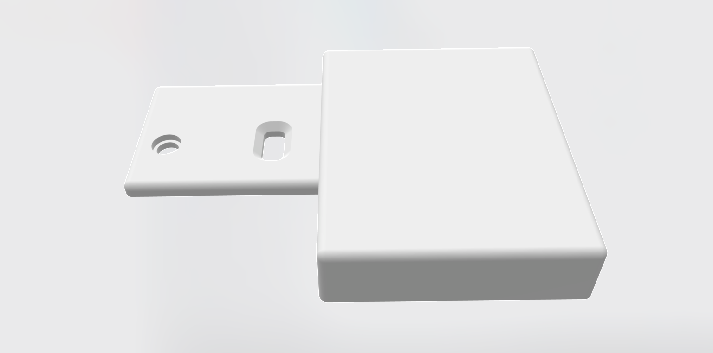

# Optional battery

A lipo battery can be added to OMX-27 v3. 

[This battery from tinycircuits is recommended](https://tinycircuits.com/products/lithium-ion-polymer-battery-3-7v-290mah). Also available from [Mouser](https://www.mouser.com/ProductDetail/TinyCircuits/ASR00007) or [Digikey](https://www.digikey.com/en/products/detail/tinycircuits/ASR00007/7404517). [Octopart link](https://octopart.com/asr00007-tiny+circuits-84715901)

The battery plug on the PCB is a JST SH connector (2 pin, 1.0 mm pitch) or you can solder the battery wires directly to the PCB. Please note the PCB markings for polarity. Looking down at the device, the red (+) terminal is on the left.

3D printable battery box models are available below:

The parts are designed to use heat-set inserts for mounting - I used M2.5 4mmx4mm inserts - and then you can just use the same screws inserted from the bottom instead.

[Rectangular box](omx-27_battery_box_1a.stl)

[L-shaped box](omx-27_battery_box_1b.stl)

