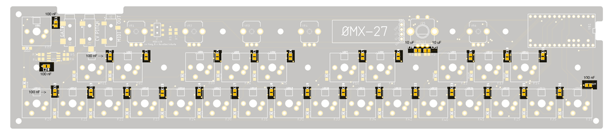
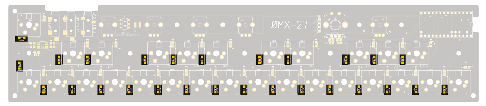

# OMX-27

  
  

### 100n and 10u capacitors  

### Diodes

### Resistors

### LEDs

The LEDs are Reverse Mount and are soldered to the back-side of the PCB. When looking at the pcb as in the  pictures, the GND leg is the top right pad for each one (marked with a red triangle in the picture below). The LED itself has a "notched" leg for GND.

