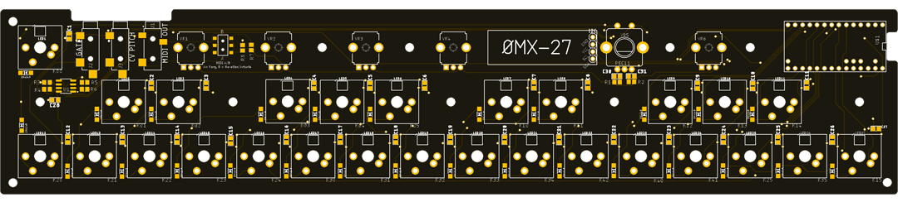
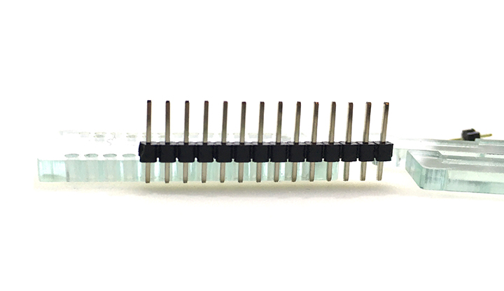
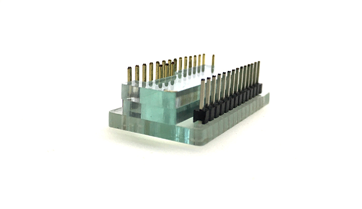

# OMX-27

  
  

# Before you start

The key-switches are going to be the VERY LAST thing you solder. __After you solder the switches in, everything on the inside is going to be inaccessible.__

Ideally you want to be able to test all the LEDs and OLED before putting the switches on.

I'd also suggest testing each switch connection with a piece of wire so you can confirm the diodes are soldered correctly.

Follow the order of operations here to make your life easier. NOTE - the keyswitches are  absolutely the last thing you solder. Make sure everything looks good

### Soldering Tips

---
# Build from Kit

### LEDs

The LEDs are __Reverse Mount__ and are soldered to the back-side of the PCB with the LED facing towards the top of the PCB. When looking at the back of the PCB as in the picture, the GND leg is the top right pad for each one (marked with a red triangle in the picture below). The LED itself has a "notched" leg for GND.

### TEENSY

For the keyplate to fit properly, the Teensy MUST be flush-mounted to the top of the main PCB.

An insulating kapton spacer is included with your kit. Use this between the bottom of the teensy and the main PCB to reduce the chances of unintended shorts.

__Teensy jig__

Use the included acrylic jig to set up your teensy like the following for soldering.  

Short side of the headers goes down to the jig and the long side up.  

Add a 1x3 and 1x1 in the appropriate places. The 1x1 directly next to the 1x3 is not connected to anything so you can solder that or not (your choice).  

Add the two spacers  (maybe even tape those two together so they don't wiggle around.

Drop the Teensy into place. There should just be a small amount of header sticking up from the Teensy at this point.  

Solder the pins to the Teensy first.

Then remove the jig and carefully remove the black plastic from the headers. __Hold onto the black spacers for the next step.__  

After you've removed the plastic, slide the thin yellow kapton spacer thingy onto the bottom of the teensy - this should end up between the teensy and the main board as an insulator. Then drop the Teensy onto the main board so it sits nice and flat. 

To keep the pins from wiggling around while soldering the bottom, either 

 * Put a big piece of tape over the whole teensy to keep it in place and to keep the pins from getting pushed out
 
 * Or push the black pastic bits from the headers onto the pins to hold them in place while soldering.

Flip the board over and solder the pins to the bottom. Try to tack/solder one pin on either side in place while pushing your finger against the teensy to make sure it's absolutely flat against the main pcb.

Once you're happy with the flatness - solder the rest of the pins. Be careful not to push the pins down while soldering.

Using flush cutters, trim the pins away. Be carefull not to nick/scratch the pcb.

### OLED

The OLED display sits on a regular header (not flush like the Teensy)> the display should be close to level with the keyplate (the OLED glass will be about 0.5-1mm higher than the keyplate).

I suggest using a section of the header plastic you removed from the Teensy headers as a spacer. Glue or tape a 1x4 chunk of the header plastic to the back of the OLED pcb and this will keep it level and support it.

Trim the headers on the top side of the OLED if you're worried about something shorting there.

### JACKS, POTS, ENCODER, ETC.

Snap pots and encoders into place and solder.

You may need to gently squeeze the snap-in mounting pins together a tiny bit to get the pots to snap into place.

### STOP HERE AND TEST THINGS

At this point you can flash the firmware and do some testing. The OLED should display and the LEDs will show a rainbow pattern on startup.

You will want to test each keyswitch on the PCB using tweezers or a piece of wire. This is a second check that the LED for that switch is working correctly.

(PIC NEEDED) 

Use the [browser_test](browser_test/index.html) script to show USB-MIDI input to your computer. Then you can check to be sure the pots are sending CCs and that you get MIDI note-ons/note-offs when you test each keyswitch's pads. Be sure you have the `oct` (octave) set to 4 on the display (change with encoder knob).

Also test the Hardware MIDI 1/8" jack with an appropriate adapter and synth. Check the A/B switch position for your particular setup (try both to be sure you have the right one).

### Acrylic Case Parts

Carefully remove the paper backing from the acrylic parts - the spacer and the back plate. Then set these aside for the next step. 

The spacer layer is pretty fragile - try not to break it. However, even if it does break, it might be fine since this is in-between the other layers.

### KEY SWITCHES

Snap all the key-switches into the keyplate (from the top). 

(PIC NEEDED)  

The switches may be a tight fit. Be sure they are snapped all the way into place.

(PIC NEEDED)  

Drop the black acrylic spacer on to the main PCB and align it around the various components. Then set the keyplate with switches into place to be sure all the pins line up and everything is nice and flat. You may need to gently bend key-switch pins into place if they got slightly bent in transport.

Use the included case screws/nuts - with the holes down the middle of the case - to fix everything together for soldering. This will ensure the key switches are held in place for soldering and that everything will remain flat.

Solder all the switches.

### Bottom Plate

Then remove the screws/nuts and then reassemble with the back plate.

The nuts fit into the captive cutouts on the bottom plate.

(PIC NEEDED)  
