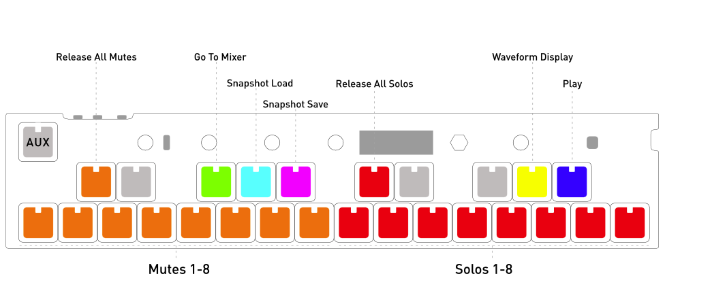

# OMX-27 Documentation

## Concepts

OMX-27 is a MIDI Keyboard and Sequencer. Both USBMIDI (in/out) and hardware MIDI out (via 1.8" TRS jack) are supported. Various "modes" can be accessed with the encoder and specific functions, parameters or sub-modes can be accessed with the encoder or key-presses/key-combinations.

Sequencer modes have 8 patterns (tracks). Sequencer modes currently send MIDI clock and transport control (start/stop) by default.

CV pitch output is limited to about 4.3 octaves.

USBMIDI should be plug-and-play with any USBMIDI compatible host. iPad works great with the camera connection kit or a [lightning to usb micro cable](https://www.amazon.com/gp/product/B09KLXNYHL). Hardware MIDI TRS output jack is switchable between Type-A and Type-B.

### Modes

The OMX-27 has multiple modes. Each is independent - only one mode can be used at a time. 

The current modes are:  
- MI - Midi Keyboard  
- CH - Chords  
- S1 - A step sequencer with 8 patterns that can be up to 64 steps. Only one pattern can be active at a time  
- S2 - The same as S1 but all 8 patterns are active  
- GR - Grids Sequencer  (A rhythm sequencer based on Mutable Instruments Grids)  
- EL - Euclidean Sequencer   
- OM - Organelle Mother  

Long press the encoder to change modes. 


## Layout


### Encoder

The encoder is the knob directly to the right of the display.

You can use the encoder to modify parameters and change the selected parameter and page. 

Short press the encoder once to toggle between selecting parameters and editing them. The selected parameter will be highlighted to reflect which mode you are in. 

Long press the encoder to change to a different mode. Once in mode selection, turn the encoder, then short-press to enter the selected mode.

### AUX Key

The top left key is the AUX Key. 

In the MIDI Keyboard and Chords modes, holding this key gives you access to shortcuts. 

In the sequencer modes, this key is a dedicated start stop button. 

This key is also used in many places to quickly edit a parameter. 

If you are in a submode, the AUX Key can be used to exit out to the main mode. 

### Potentiometers

The OMX-27 has 5 potentiometers which are mapped to send continuous controller MIDI messages (CCs). There are 5 banks of CCs available. You can switch banks using the PBNK parameter in MI Mode. 

Bank A is selected by default with the CCs set to controller numbers 21, 22, 23, 24 and 7 (volume). 

The CC's can also be reconfigured on device in the CC Config page, which is found on the last page of the MI Mode parameters. You can also configure the CC banks all at once via the web editor.


### Key Switches

The functions of the key switches changes depending on which mode you are in. 

In MI Mode, the key switches work like a normal MIDI keyboard. 

In other modes, the keys have specific functions depending on the mode or submode. Most key interactions should also light up that key's LED.

In this documentation keys will be referred to by number, from left to right and position, top or bottom. Mentions of "White" or "Black" keys are in reference to a standard piano keyboard layout.

__"Black keys" (sharp/flat keyboard keys)__

The top row (black) keys are referenced as __Top 1-10__.

The first 2 black keys are Function Keys (FUNC)
- F1 - First black key
- F2 - Second black key

FUNC keys are used to perform various shortcuts depending on the mode. 

The other black key functions depend on the current mode.

__"White keys" (bottom row)__

The bottom row (white) keys are referenced as __Bottom 1-16__.

These have different functions depending on the current mode. For example, in sequencer modes, these are the sequencer step on/off keys.

---

### Saving

To save your current session to memory, first enter Mode Select by holding the encoder. While this is active press AUX to save. 

The next time you restart your device, your last active mode will be loaded, and saved patterns and settings will be recalled. 

Saving is a long operation and not recommended to do while in the middle of a performance. 

# Modes
---
## MI - MIDI

MIDI Keyboard. 

AUX Shortcut keys: 
- Holding AUX lets you quickly edit the selected parameter  
- Bottom keys 1 and 2 are octave up/down  
- Top keys 1 and 2 cycle through the selected parameter on the display  
- Top key 5 disables MidiFX  
- Top keys 6-10 selects a MidiFX Group to use  
   - Double click or long hold a MidiFX Group to enter the MidiFX submode  
- Bottom key 12 enters the arpeggiator pass-through submode  
   - Pass-through allows you to edit the parameters of the arpeggiator while also still using the keyboard to play notes  
- Bottom key 13 cycles through arpeggiator patterns  
- Bottom key 14 cycles through arpeggiator octave ranges  
- Bottom key 15 toggles the arpeggiator hold function  
- Bottom key 16 toggles the arpeggiator on and off  

Parameters:

Page 1:
- `OCT`: current Octave  
- `CH`: active MIDI Channel 
- `CC`: displays CC being sent when turning a potentiometer
- `NOTE`: displays the last note number that was sent

Page 2:
- `RR`: RoundRobin MIDI Channel distribution
- `RROF`: RR offset value   
- `PGM`: MIDI program change  
- `BNK`: MIDI bank select.

Page 3:
- `PBNK`: Potentiometer bank select
- `THRU`: when "On" incoming USBMIDI is passed to TRS MIDI Out.
- `MCRO`: MIDI Macro Mode Select (default is OFF)
- `M-CH`: MIDI Macro Mode Channel

Page 4:
- `ROOT` : select the root note for scale mode
- `SCALE` : select a scale or turn off scale mode
- `LOCK` : locks to the active scale. If this is enabled, you can only play notes in the scale
- `GROUP` : groups all the notes of the scale across the lower row of 16 keys. 

Page 5:
- `CC` : press the encoder to enter the CC configuration submode.


#### Musical Scales

Scales can be turned on using the 4th parameter page. When a scale is enabled, the keys in the scale light up, and the root notes light up a brighter color. You can still play chromatically and out of key. 

Enabling the 'LOCK' param makes it so only the notes in the scale send midi notes out. 

Turning on the 'GROUP' parameter maps the scale across the lower row of 16 keys. The root note starts on bottom key 2 which would normally be a C in chromatic mode. 

These scale settings also control the scale of the Scaler MidiFX when they are set to use the global scale. 

#### CC Configuration Submode

This mode lets you change the CC values that the potentiometers send out. 

Bottom Keys 1-5 let you quickly change the selected bank.  

Press the AUX key to exit. 


#### MIDI Macro Modes

Midi macro modes are specialized Midi controller modes designed to be used with specific hardware that can be controlled via Midi. 

If a midi macro is selected, you can double click the AUX key to enter the midi macro mode, and double click the AUX key to exit the macro mode.

Midi macro modes send control midi commands on the Midi Macro channel, which is `M-CH` in the parameters.


##### M8 Macro Mode

From MI Mode, be sure `M8` is selected from the `MCRO` parameter and then double click the AUX button to enter Macro Mode.

`M-CH` should be set to the same value as the Control Map Channel in the M8 MIDI settings screen. Default is set to channel 10.  

Double click the AUX button again to exit Macro Mode.

The M8 macro mode has two pages, which change what the Keys do.

* Mute Solo Page:

The bottom row of keys correspond to mutes (orange) and solos (red). The top "black keys" are as follows:  

```
Orange - release all mutes  
Lime - go to mixer screen  
Cyan - snapshot load/paste *   
Magenta - snapshot save/enter selection mode *  
Red - release all solos  
Yellow - waveform display  
Blue - play  
```


When M8 is selected from the `MCRO` parameter - potentiometers send on the `M-CH` MIDI channel in both regular keyboard mode and in the macro mode. However, notes played on keys send on the currently selected `CH` MIDI channel.

\* __Notes:__  
* M8 must be on the Mixer view for snapshots.  
* Snapshot Load uses the M8 key combo [SHIFT]+[OPTION]. On any view with a grid (song, chain, phrase, table, etc.) this key enters selection mode.  
* Snapshot Save uses the M8 key combo [SHIFT]+[EDIT]. On any view with a grid this key pastes the copied contents from selection mode.  

* Control Page:

This page lets you navigate the M8 using the keys on the device instead of the keys on the M8.

Top Key 1 and Bottoms Keys 1-3: These correspond to the directional arrow keys. 

Top Key 4: Option Key
Top Key 5: Edit Key
Bottom Key 6: Shift Key
Bottom Key 7: Play Key

The right half of the Keyboard is a 1-octave midi keyboard that sends notes on the same midi channel as when not in macro mode. 


### MidiFX

MidiFX are effects that can be applied after midi data is generated by playing keys or a sequencer and before any midi data goes out of the device. 

MidiFX can currently only be used within the: MIDI Keyboard (MI), Chords (CH) and Euclidian (EL) modes.

MidiFX currently only work on internally generated midi, but may support external midi coming in from USB in the future. 

MidiFX are arranged in groups of 8 MidiFX. A group of 8 is called a MidiFX Group. In the MI Mode, midi notes generated by playing the keyboard can only be routed to one MidiFX Group. In the sequencer modes, midi notes can be routed to different MidiFX groups by track. 

Think of a MidiFX group as a pedalboard for Midi. Midi data comes in from the left and go to MidiFX slot 1, then out of slot 1 to slot 2, until slot 8, then out of the device. 

You can change the active MidiFX group in the MI Mode and the Chords modes by holding aux and pressing one of the Top Keys 6-10. 

To enter the MidiFX submode, hold AUX, then hold or double click on a MidiFX Key(Top Keys 6-10). 

Top Key 1: Copy  
Top Key 2: Paste  
Top Key 1 + 2: Cut  
Top Keys 3 - 10: Select a MidiFX slot  
Bottom Keys: Add or change the type of MidiFX for a slot. You must hold down the MidiFX slot key in order to change.   

To move a MidiFX slot around, you can either cut and paste, or you can hold a MidiFX slot key and turn the encoder.  

There are several different MidiFX available for each slot. Select a MidiFX slot, and you can edit the parameters for that instance of a MidiFX.  

Each MidiFX type has a chance parameter. If this is less than 100%, than there is a chance this effect will not be applied.  

Available MidiFX:  
- Chance: Uses randomness to determine if a note passes through: 100% or gets killed: 0%  
- Transpose: Transpose midi notes by semitones or octaves  
- Randomizer: Randomize notes by range, octaves, velocities, and note lengths.  
- Harmonizer: Generate multiple notes from a single note. Great for 1 key chords, or to randomly play chords by setting it's chance parameter to less than 100%  
- Scaler: This forces notes into a specific scale.  
   - By default this uses the global scale. Modifying the root and scale pattern parameters changes the global scale.   
   - You can turn 'GLBL' to off to make this MidiFX instance use it's own unique root and scale pattern.   
- Make Mono: This forces polyphonic midi notes into monophonic.   
- Arpeggiator: This is an advanced arpeggiator. An arpeggiator MidiFX is automatically  added to a MidiFX group if you use any of the arpeggiator AUX quick keys.  
   - Try combining the arpeggiator with other MidiFX either before or after the arpeggiator for interesting effects.  
   - Arpeggiators are reasonably resource intensive, try to avoid using more than 3 of them in a MidiFX group for optimal performance.  

### Arpeggiator

The arpeggiator is an advanced arpeggiator with many different combinations of patterns, Mod Patterns, and Transpose patterns. 

The arpeggiator is actually a MidiFX and is only available in the modes that support MidiFX: MIDI Keyboard (MI), Chords (CH), and Euclidian Sequencer (EL).

In MIDI Keyboard and Chords modes, holding AUX allows you to quickly change basic settings of the arpeggiator. In order to access the more advanced functionalities, you need to access the arpeggiator parameters by either entering the MidiFX Group submode or by accessing the Arpeggiator pass-through mode by using AUX + Bottom Key 12.

The arpeggiator sends clock when in use.

Parameters:

Page 1:
- `MODE`: Arpeggiator mode: On, 1-Shot, Once, Hold  
- `PAT`: The pattern of the arpeggiator  
- `RSET`: Determines what will cause the arpeggiator to reset  
- `CHC%`: How likely an incoming note will be used with the arpeggiator. Try playing with in the euclidean sequencer mode  

Page 2:
- `RATE`: How fast the arpeggiator plays  
- `RANG`: How many octaves to advance through  
- `GATE`: How long a note coming out of the arpeggiator is  
- `BPM`: Controls the master tempo  

Page 3:
- `ODIST`: How many semitones to consider an octave. Set to -12 to make the arpeggiator go downwards. Set to a semitone offset if you like to get weird  

Page 4:
These are not modifyable  
- `VEL` : Velocity based on first notes that turn on the arp  
- `CHAN` : First note that starts the arp sets the channel  
- `MIDI` : If midi data is output
- `CV` : If CV data is output  

Page 5 - Mod Pattern:
- Each of the 16 steps can be used to modify the arp pattern in various ways  

Page 6 - Transpose Pattern:
- Each of the 16 steps can be used to transpose notes in semitones 
- Recommend trying to use for some cool one key bass patterns  


### CH - Chords


### S1 - Sequencer 1

#### "Black keys" (sharp/flat keyboard keys)

The first 2 black keys are Function Keys (FUNC)
- F1 - First black key
- F2 - Second black key

The next 8 are Pattern Keys and they select the active sequence pattern (P1-P8).

Hold a key (long press) to access parameters for that pattern. This is "Pattern Params".


#### "White keys" (bottom row)

Sequencer Step Keys - These are your sequencer step on/off keys.

Hold a key (long press) to access parameters for that step. This is "Note Select / Step Parameters". F1 + Step Key is also a quick shortcut.

Step sequencer - One pattern active at a time.

Keys/Commands:   
 - AUX is Start/Stop  
 - Start/Stop sends MIDI transport control, and MIDI clock when running  
 - Pattern Key: Selects playing pattern  
 - F1 + AUX: Reset sequences to first/last step  
 - F2 + AUX: Reverse pattern direction  
 - F1 + Pattern Key: Enter __Step Record__ (transport must be stopped)  
 - F2 + Pattern Key: Mute that pattern  
 - F1 + Step Key: Enter __Note Select / Step Parameters__  
 - Long press a Step Key: Enter __Note Select / Step Parameters__   
 - Long press a Pattern Key: Enter __Pattern Parameters__  
 - AUX-key exits sub-modes  
 - Hold F1 + F2: first 4 "white keys" select "page" of the current pattern (depending on pattern length)  

Parameters:  
(see below)  


### S2 - Sequencer 2

Step sequencer - All patterns active.

Keys/Commands:   
 - AUX is Start/Stop  
 - Start/Stop sends MIDI transport control, and MIDI clock when running  
 - Pattern Key: Selects active pattern  
 - Encoder changes "page" for sequence parameters (with no parameter highlighted)  
 - Short-press encoder to highlight active parameter to edit  
 - F1 + AUX: Reset sequences to first/last step  
 - F2 + AUX: Reverse pattern direction  
 - F1 + Pattern Key: Enter __Step Record__    
 - F2 + Pattern Key: Mute that pattern  
 - F1 + Step Key: Enter __Note Select / Step Parameters__  
 - Long press a Step Key: Enter __Note Select / Step Parameters__   
 - Long press a Pattern Key: Enter __Pattern Parameters__  
 - AUX-key exits sub-modes  
 - Hold F1 + F2: first 4 "white keys" select "page" of the current pattern (depending on pattern length)  

Parameters:  
- `PTN`: selected pattern  
- `TRSP`: transpose (by semitones)  
- `SWNG`: swing  
- `BPM`: tempo   

- `SOLO`: set the current pattern to MIDI Solo  
- `LEN`: pattern length  
- `RATE`: default note length (1/64th to whole note)  
- `CV`: enable to send CV from this pattern   


In the sequencer modes, the default setup is a GM Drum Map with each pattern on a consecutive midi channel. So that's notes 36, 38, 37, 39, 42, 46, 49, 51 on channels 1-8.


### GR - Grids Sequencer

An adaptation of the Mutable Instruments "Topographic drum sequencer" module.

See the original [Grids Manual](https://mutable-instruments.net/modules/grids/manual/) [or a video ?] for more.

Grids is a 4-channel/instrument MIDI trigger generator specialized in the creation and sculpting of rhythmic patterns. The "grid" refers to a map or library of preset drum patterns arranged in a 5x5 grid - which you can steer using X/Y controls.

Typical drum use would be Bass Drum, Snare, Closed HiHat, Open HiHat (The default note numbers are mapped to these in the GM drum map).

**Quick Keys**
Grids has many quick keys. Pressing these keys quickly jumps the display to select a specific parameter which can be adjusted with the encoder.

Keys/Commands:   
 - AUX is sequencer Start/Stop  
 - Pots 1-4 control "event density" (probability) of 4 instruments - values are shown on display  
 - Pot 5 sets resolution (1/2, 1, 2)
 - Bottom row keys 1-8 are quick-keys for X/Y values - hold a key and turn encoder to change that instrument's X or Y value. You can hold multiple keys to change X/Y on multiple instruments at the same time  
 - LEDs on Keys 9-12 show trigger activity of the playing pattern  
 - Lighted Keys 13,14,16 are quick keys for ACNT/XAOS/BPM
 - Pattern keys (black keys) can load "snapshots" of density/x/y settings
 - F2 + Pattern saves a "snapshot" current state of that pattern. Patterns do not automatically save, this is a performance feature, allowing you to load a pattern, tweak it, then quickly load back to it's original state  

  Instrument View Mode:
  - F1 + Keys 1-4 jump to Instrument View. This shows the current pattern on that instrument (over 2 pages since patterns are 32 steps) and playhead. The LED render of the pattern will update to show each page while playing   
  - Top row lighted keys(A#1, C#2, D#2, F#2) are quick-keys for ACNT/X/Y/XAOS
  - First 4 keys of bottom row will not be specially lit since they are rendering the pattern, but will allow you to quickly select a different instrument  
  - F2 is a quick key to jump to params page to set Note Number, MIDI Channel and BPM  
  - Key 3(F#1) in Instrument View is a quick key for Midi Channel for the instrument  
  - AUX-key exits Instrument View 

  Midi Keyboard Mode:
   - F1 plus bottom key 16 enters into the Midi Keyboard for sending CCs or playing over the top of the sequencer. Everything works the same as mode MI  
   - Hold Aux and bottom key 16 to exit out of the Midi Keyboard mode  

Parameters:  
Page 1 Event Densities:
- `DS 1`: event density - instrument 1  
- `DS 2`: event density - instrument 2  
- `DS 3`: event density - instrument 3  
- `DS 4`: event density - instrument 4  

Page 2:
- `NT 1`: note number - instrument 1  
- `NT 2`: note number - instrument 2  
- `NT 3`: note number - instrument 3  
- `NT 4`: note number - instrument 4  

Page 3:
- `ACNT`: accent amount (larger number is more variation) - applies to all instruments   
- `X `: X amount for selected instrument  
- `Y `: Y amount for selected instrument  
- `XAOS`: chaos amount - applies to all instruments  

Page 4 - Main Mode:
- `BPM`: tempo  

Page 4 - Instrument View Active:
- `NT -`: note number for active instrument  
- `M-CHAN`: midi chanel for active instrument  
- `BPM`: tempo

### EL - Euclidian Sequencer


### OM - Organelle Mother

Pretty much the same as MI, but with the following tweaks for Organelle Mother on norns/fates/raspberry-pi.

- AUX key sends CC 25 (127 on press, 0 on release)
- Encoder turn sends CC 28 (127 on CW, 0 on CCW)


### Screensaver 
After a default timeout (3 minutes), the display will be blanked and in MI Mode a "screensaver" animation will show on the LEDs. The rightmost pot (#5) can be turned to adjust the color. Touching any keys or any of the other pots will exit the screensaver.  

In S1/S2 the screen will blank, but there is no LED animation.


## Sub-Modes

AUX-key exits sub-modes

### Note Select / Step Parameters

Long press a step key to enter this mode. Here you can change the note values (note number, velocity, note length and octave), set CC parameter-lock values with the knobs, and set step parameters (step events, step probability, trig conditions).

While in Note Select, the rightmost and leftmost keys will blink (orange or blue)- these 2 keys will shift the current octave up or down.

Press AUX to exit Note Select.  

Parameters:  

Page 1:  
- `NOTE`: midi note number  
- `OCT`: octave  
- `VEL`: note velocity  
- `LEN`: note length in steps (1-16)   

Page 2:  
- `TYPE`: step event type (see below)  
- `PROB`: percentage of the step triggering  
- `COND`: trig conditions (see below)  

Page 3: (set CC parameter-locks)  
- `L-1`: pot 1 p-lock value for this step  
- `L-2`: pot 2 p-lock value for this step  
- `L-3`: pot 3 p-lock value for this step  
- `L-4`: pot 4 p-lock value for this step  

Touching any potentiometer while in Note Select will set that p-lock value.

To reset/erase a p-lock - Highlight the parameter and turn the encoder to the left.

__Step Events (TYPE):__
"-" mute
"+" play
"1" reset to first step
">>" set parttern direction forward
"<<" set parttern direction reverse
"#?" jump to random step number
"?" set random event (of any of the previous events) for that one step

__Trig conditions - A/B Ratios (COND):__
Play that step on the A cycle of B total cycles (or bars) of the pattern. Default is 1:1 (every time).
First number - play step on that cycle thru the pattern
Second number - resets the counter after that pattern cycle.

So 1:4 would play on the first cycle, not play on the next three and then reset (after the 4th cycle). 3:8 would play only the 3rd cycle and reset after the 8th.


### Step Record

(SH-101-ish style note entry)

Holding F1 + a Pattern Key will enter Step Record Mode.

Enter notes from the keyboard and the sequence step will automatically advance to the next step. Change knob 1-4 positions to set a CC parameter lock for that step. Knob #5 (far right) will enter a velocity value for that step (there is no visual feedback when entering values from the knobs.

If you want to skip steps while entering notes, use the encoder button to select the STEP parameter and rotate to the step you want to change/update. While a step is selected, you can also record plocks/velocity for that step with the knobs without changing the note value. 

There are two pages of parameters in Step Record. First is the current octave (OCT), step number (STEP), note-value (NOTE), and pattern number (PTN). Second shows the step event parameters TYPE, PROB and COND as described above.

Press AUX to exit Step Record.

Keys/Commands:  
- Potentiometers 1-4 set a CC parameter lock  
- Potentiometers 5 sets a step velocity   
- AUX exit this sub-mode  


### Pattern Parameters

Long press Pattern Key to enter Pattern Params Mode.

Turning the encoder will show different pages of parameters.

A short-press on the encoder will select the active parameter for editing. Press the encoder repeatedly until nothing is selected to change pages.

Press AUX to exit Pattern Parameters.

Parameters:  

Page 1:  
- `PTN`: selected pattern  
- `LEN`: pattern length  
- `ROT`: rotation  
- `CH`: midi channel   

Page 2 (see Sequence Reset Automation below):  
- `START`: steart  
- `END`: end  
- `FREQ`: frequency  
- `PROB`: probability   

Page 3:  
- `RATE`: default note length (1/64th to whole note)    
- `SOLO`: MIDI solo   


Keys/Commands: 
- Step Keys set pattern length  
- F1 + pattern copies pattern  
- F2 + pattern pastes pattern (to other pattern slot)  
- F1 + F2 + pattern clears the pattern back to GM drum map default (and clears all plocks)  

(you can paste multiple times - paste buffer should stay the same until you copy again)

MIDI solo:
Set a pattern to MIDI solo and you can play the keyboard while that pattern is selected.

Note - once in MIDI solo, you will only be able to change the active pattern by using the encoder knob.

### Pattern Parameters: Sequence Reset Automation

This is located on the second page of pattern parameters

The goal of this "Sequence Reset Automation" feature was developed in the spirit of classic sequencers that can generate more complex sequences from simpler ones by setting any step in a given sequence to trigger a "reset" based on some constraint (i.e., number of cycles, probability, random).

Note - This behavior is a pattern-based solution. You can also execute step-based resets in Step Parameters.

Settings:

- START (Currently 0 - PatternLength-1): Use this to set the start step in current pattern to reset to for beginning a new cycle.

- END (Currently 0 - PatternLength-1): Use this to set the last step in current sequence to end/reset pattern cycles. This in essence is the step that will be used to trigger resets.

- FREQ of trigger reset (i.e., every X sequence cycle iterations)

- PROB of triggering reset (percentage)

NOTE: Setting STEP = 0 and PROB = 1 dictates random trigger steps which can lead to interesting results by jumping to random position/step.

---

# MIDI Switch for the mini TRS output jack connection

A hardware switch on the device will let you swap between Type-A and Type-B for the hardware MIDI TRS output jack.


Products That Use Type-A mini TRS Jack Connections
- ADDAC System products
- Arturia BeatStep (not to be confused with the BeatStep Pro)
- Dirtywave M8
- IK Multimedia products
- inMusic (Akai) products
- Korg products
- Line 6 products
- little Bits w5 MIDI module
- Make Noise 0-Coast

Products That Use Type-B mini TRS Jack Connections
- Arturia BeatStep Pro
- Faderfox products
- Novation products
- Polyend products
- 1010music Original Series 1 modules, Series 2 modules, Blackbox, MX4 and Euroshield

See [https://minimidi.world](https://minimidi.world) or [https://1010music.com/stereo-minijacks-midi-connections-compatibility-guide](https://1010music.com/stereo-minijacks-midi-connections-compatibility-guide) for more information

