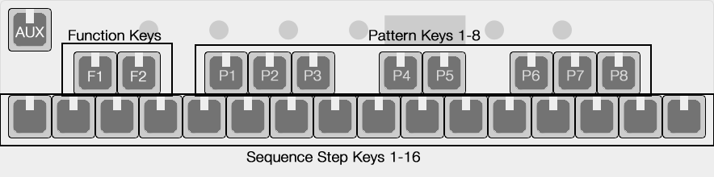

# OMX-27 Documentation

## Concepts

OMX-27 is a MIDI Keyboard and Sequencer. Both USBMIDI and hardware MIDI (via 1.8" TRS jack) are supported. Various "modes" can be accessed with the encoder and specific functions, parameters or sub-modes can be accessed with the encoder or key-presses/key-combinations.

Sequencer modes have 8 patterns (tracks). Sequencer modes currently send MIDI clock and transport control (start/stop) by default.

CV pitch output is limited to about 4.5 octaves.

USBMIDI should be plug-and-play with any USBMIDI compatible host. iPad works great with the camera connection kit. Hardware MIDI TRS jack is switchable between Type-A and Type-B.

## Layout

Top left key = AUX Key. 

Potentiometers are mapped by default to CCs 21, 22, 23, 24 and 7 (volume). These can be changed in the firmware. Hopefully this will be configurable from a device menu or a web-MIDI interface in future.

__Encoder__

Long press encoder to enable mode change. Turn to switch modes, short-press to enter mode.

Within the modes a short press on the encoder will select a parameter to edit.

In some modes, turning the encoder is set to a default param (like octave or BPM)

### Key Switches

In MIDI modes the key switches work as a normal MIDI keyboard.

In sequencer modes the switches are broken into groups - Function Keys, Pattern Keys and Step Keys.

__"Black keys" (sharp/flat keyboard keys)__ 

The first 2 black keys are Function Keys (FUNC)  
- F1  
- F2

The next 8 are Pattern Keys and they select the active sequence pattern (P1-P8).

Hold a key (long press) to access parameters for that pattern. This is "Pattern Params".

__"White keys" (bottom row)__

Step Keys - These are your sequencer step on/off keys. 

Hold a key (long press) to access parameters for that step. This is "Note Select".

---

## Modes

Long-press the encoder to enter Mode Select. Short-press to enter that mode.

While in Mode Select (before you short-press), you can save the state of the sequencer and settings to memory by hitting the AUX key.

### MI - MIDI 

MIDI Keyboard. Encoder selects octave or channel.

AUX does nothing here (yet)

### S1 - Sequencer 1

Step sequencer - One pattern active at a time.

 - AUX is Start/Stop 
 - Start/Stop sends MIDI transport control, and MIDI clock when running 
 - Pattern Key: Selects playing pattern
 - F1 + AUX: Reset sequences to first/last step 
 - F2 + AUX: Reverse pattern direction 
 - F1 + Pattern Key: Enter "Step Record Mode" (transport must be stopped)
 - F2 + Pattern Key: Mute that pattern  
 - Long press a Step Key: Enter "Note Select Mode"
 - Long press a Pattern Key: Enter "Pattern Params Mode"
 - AUX-key exits sub-modes  

### S2 - Sequencer 2

Step sequencer - All patterns active.

 - AUX is Start/Stop 
 - Start/Stop sends MIDI transport control, and MIDI clock when running 
 - Pattern Key: Selects active pattern
 - Encoder changes "page" for sequence parameters (with no parameter highlighted)
 - Short-press encoder to highlight active parameter to edit
 - F1 + AUX: Reset sequences to first/last step 
 - F2 + AUX: Reverse pattern direction 
 - F1 + Pattern Key: Enter "Step Record Mode"
 - F2 + Pattern Key: Mute that pattern  
 - Long press a Step Key: Enter "Note Select Mode"
 - Long press a Pattern Key: Enter "Pattern Params Mode"
 - AUX-key exits sub-modes  

In the sequencer modes, the default setup is a GM Drum Map with each pattern on a consecutive midi channel. So that's notes 36, 38, 37, 39, 42, 46, 49, 51 on channels 1-8.

### OM - Organelle Mother

Pretty much the same as MI, but with the following tweaks for Organelle Mother on norns/fates/raspberry-pi.

- AUX key sends CC 25 (127 on press, 0 on release)  
- Encoder turn sends CC 28 (127 on CW, 0 on CCW)  

## Sub-Modes

AUX-key exits sub-modes  

### Note Select / Step Parameters

Long press a step key to enter this mode. Here you can change the note values (note number, velocity, note length and octave), set CC parameter values with the knobs, and set step parameters (step probability, trig conditions).

### Step Record

(SH-101-ish style note entry)

Holding F1 + a Pattern Key will enter Step Record Mode.

Enter notes from the keyboard and the sequence step will automatically advance to the next step. Change knob positions to set CC plock for that step.

You can use the encoder button to skip a step (making no note change)

Short-press encoder to highlight specific params (like octave) and turn the encoder to change the value.

### Pattern Params

Long press Pattern Key to enter pattern params

Encoder press to get parameters for length, rotation and MIDI channel for that pattern (blinking)

Step Keys also set pattern length 
F1 + pattern will copy pattern  
F2 + pattern will paste pattern to other pattern slot  
F1 + F2 + pattern will clear the pattern back to GM drum map default (and clear all plocks)  

(you can paste multiple times - paste buffer should stay the same until you copy again)

### Pattern Params: Sequence Reset Automation

This is located on the second page of pattern parameters

The goal of this "Sequence Reset Automation" feature was developed in the spirit of classic sequencers that can generate more complex sequences from simpler ones by setting any step in a given sequence to trigger a "reset" based on some constraint (i.e., number of cycles, probability, random).

Settings:

- START (Currently 0 - PatternLength-1): Use this to set the start step in current pattern to reset to for beginning a new cycle. 

- END (Currently 0 - PatternLength-1): Use this to set the last step in current sequence to end/reset pattern cycles. This in essence is the step that will be used to trigger resets. 

- FREQ of trigger reset (i.e., every X sequence cycle iterations) 

- PROB of triggering reset (0 = Off, 1 = 100%, 2 = 50%, 3 = 33%) - TODO: change to glyphs 

NOTE: Setting STEP = 0 and PROB = 1 dictates random trigger steps which can lead to interesting results by jumping to random position/step.

# MIDI Switch for the mini TRS jack connection

A hardware switch on the device will let you swap between Type-A and Type-B for the hardware MIDI TRS jack.  

Products That Use Type-B mini TRS Jack Connections  
- Arturia BeatStep Pro  
- Novation products  
- Polyend products  
- 1010music Original Series 1 modules, Series 2 modules, Blackbox, MX4 and Euroshield  

Products That Use Type-A mini TRS Jack Connections   
- ADDAC System products  
- Arturia BeatStep (not to be confused with the BeatStep Pro)  
- IK Multimedia products  
- inMusic (Akai) products  
- Korg products  
- Line 6 products  
- little Bits w5 MIDI module  
- Make Noise 0-Coast  

See https://1010music.com/stereo-minijacks-midi-connections-compatibility-guide for more information

