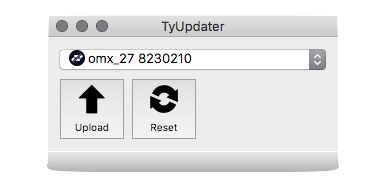

# OMX-27


Mechanical key switch midi keyboard and sequencer. Based on Teensy 3.2 and Cherry MX RGB key switches.

## Firmware 

Kits are shipped with a blank Teensy. You will need to flash the firmware to the device.

### Load pre-compiled firmware w/ TyUpdater

Download OMX-27 firmware "hex" file from https://github.com/okyeron/OMX-27/releases or the Firmware-Hexes directory in this repo.

Get TyTools [from GitHub here](https://github.com/Koromix/tytools/releases). More info here (https://koromix.dev/tytools).

Copy TyUpdater to your machine and open it. Be sure your OMX-27 is plugged in. It should show up in the TyUpdater application.



Click the Upload button and select the firmware hex file you want to upload. This should upload the firmware and the OMX-27 should reboot. That's it.


### Teensyduino (compile yourself)

Install Teensyduino from the [PJRC website](https://www.pjrc.com/teensy/teensyduino.html).

In Teensyduino Library Manager - check to be sure these are installed and on the most recent versions.

__Libraries:__  
Adafruit_Keypad  
Adafruit_NeoPixel  
Adafruit_SSD1306  
Adafruit_GFX_Library  
U8g2_for_Adafruit_GFX  
Adafruit_FRAM_I2C  

Also check to be sure MIDI Library (by Francois Best / fortyseveneffects) is updated to 5.02 (I believe this is installed by default with Teensyduino)

Set the following for the Teensy under the Tools menu:

__Board:  Teensy 3.2/3.1__  
__USB Type: MIDI__  
__CPU Speed: 120 MHz (overclock)__  

Open the sketch at `OMX-27-firmware/OMX-27-firmware.ino`, click verify to ensure it all compiles and upload to flash the firmware to the hardware, pushing the button on the Teensy first.

### PlatformIO / VSCode (optional)

Ensure Homebrew in installed. [Instructions](https://brew.sh/)  
Install PlatformIO CLI tools. [Detailed Instructions](https://platformio.org/install/cli)

```sh
# Mac OSX
brew install platformio

# check out the project
git checkout https://github.com/okyeron/OMX-27.git

# go to the project directory
cd OMX-27

# compile the project (this may take a while the first time)
pio run

# upload to hardware (don't forget to push button on Teensy)
pio run -t upload

# use serial monitor for debugging
pio device monitor

# clear FRAM/EEPROM
pio run -t clear-storage
```

(optional) Install PlatformIO IDE VSCode extension. [Instructions](https://platformio.org/platformio-ide)

Install EditorConfig extension for your text editor. [Instructions](https://editorconfig.org/)
 
Note: when making changes using the PlatformIO toolchain, please ensure the sketch still builds on Teensyduino before opening a PR.

## BOM

[Bill of Materials](<build/BOM.md>)

## Build

[Build Guide](<build/Build-Kit.md>)

## Docs

[Documentation](<Docs.md>)

## FAQ

Q: What key switches are recommended?  
A: Any RGB switches with a Cherry MX footprint can be used - I'm using Cherry MX RGB and these are linked in the [BOM](<build/BOM.md>). Different varieties are available (Red, Brown, etc.)

Q: Can I use other key switches?  
A: Yes - as long as they have the same footprint as Cherry MX switches and a window/opening for the LED to shine through. Low profile keys like the Cherry Low Profile or Kailh Choc switches have a different footprint and will not work.

Q: What about recommended Keycaps?  
A: Also listed in the [BOM](<build/BOM.md>). You want an MX stem cap, with translucency or a window for the LED to shine through. DSA profile caps work well.

Q: Does this project require soldering?  
A: Yes. Thru-hole soldering is required along with some easy SMD (LEDs and jacks).

Q: What's with these LEDs?   
A: This project uses SK6812-MINI-E reverse mount LEDs. They are somewhat hard to find, so I'll try to offer them included with kits. They are easy to solder, even if you've not done much SMD.

Q: Can I get the Gerbers or order the pcbs myself?  
A: No. Not open source at this time.

Q: Can I get some of those windowed keycaps you're using?  
A: Yes (send me an email).
