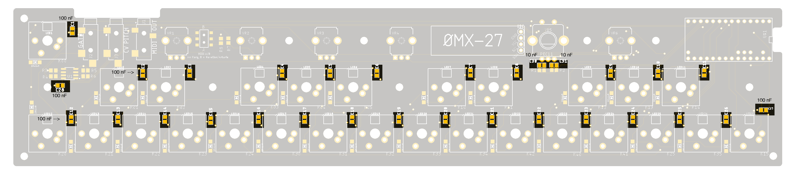
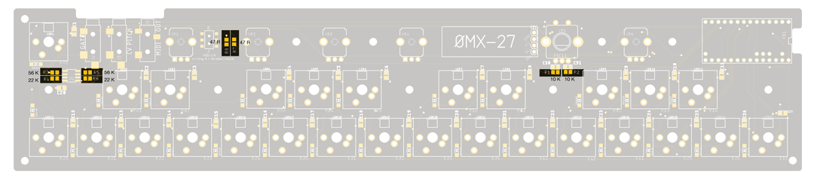
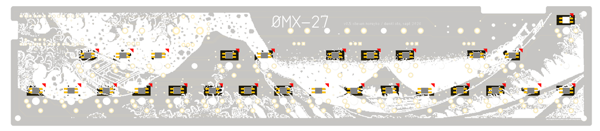
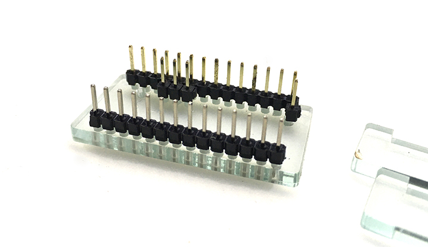
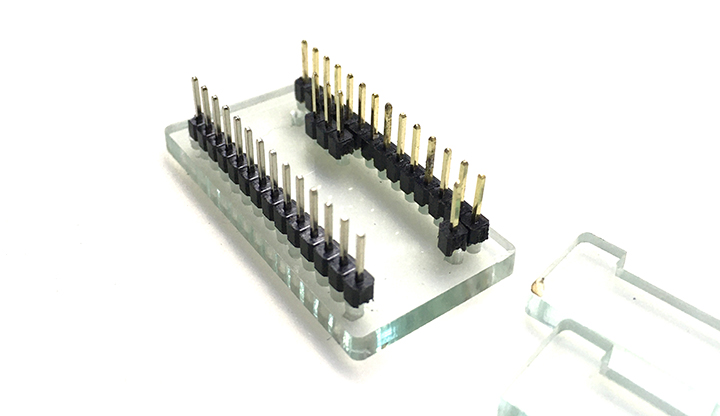
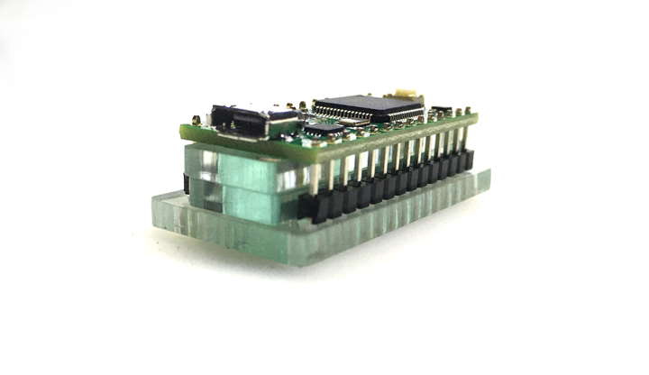
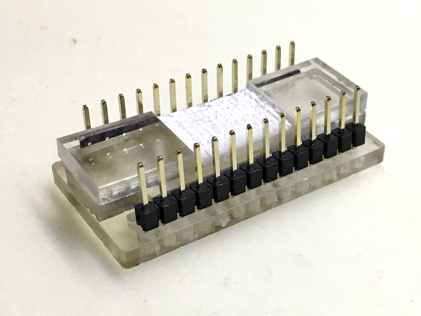
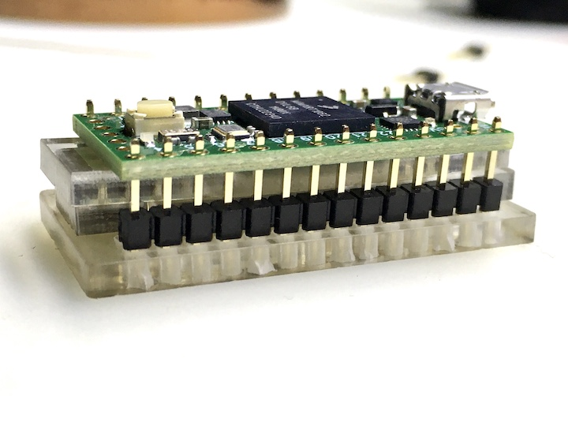

# OMX-27

  
  

# Before your start

The key-switches are going to be the VERY LAST thing you solder. __After you solder the switches in, everything on the inside is going to be inaccessible.__

Ideally you want to be able to test all the LEDs and OLED before putting the switches on.

I'd also suggest testing each switch connection with a piece of wire so you can confirm the diodes are soldered correctly.

Order of operations here does not matter for anything aside from the keyswitches being absolutely last.

---
# Build

Everything should be wel marked on the PCB itself, but here's a visual guide and some tips just in case.

### 100n and 10n capacitors  

Everything is 100n caps except for the two next to the encoder which are 10n

### Diodes

The stripes (cathode pin) on each diode are all facing towards the top of the PCB. The one oddball (top left key) has its stripe facing to the outside of the board.

### Resistors

### IC

U1 - the TLV9062 op-amp here is oriented with pin 1 at the bottom right side. Extra large white dot added here in picture for emphasis.  

### LEDs

The LEDs are __Reverse Mount__ and are soldered to the back-side of the PCB with the LED facing towards the top of the PCB. When looking at the back of the PCB as in the picture, the GND leg is the top right pad for each one (marked with a red triangle in the picture below). The LED itself has a "notched" leg for GND.

### TEENSY

For the keyplate to fit properly, the Teensy MUST be flush-mounted to the top of the main PCB.

(Teensy 3.2 and PCB v1.5 only) An insulating kapton spacer is included with your kit . Use this between the bottom of the teensy and the main PCB to reduce the chances of unintended shorts.

__Teensy 3.2 jig__  

Use the included acrylic jig to set up your teensy like the following for soldering.  

Short side of the headers goes down to the jig and the long side up.  

Add a 1x3 and 1x1 in the appropriate places. The 1x1 directly next to the 1x3 is not connected to anything so you can solder that or not (your choice).  

Add the two spacers  (maybe even tape those two together so they don't wiggle around.

Drop the Teensy into place. There should just be a small amount of header sticking up from the Teensy at this point.  

DON'T SOLDER A HEADER TO THE VUSB PIN - it's not used. This is the 1x1 pin/hole right next to the USB jack on the Teensy (on the inside row).

__Teensy 4.0 jig__  

The Teensy 4.0 version (board v2.0) only uses the 2 outer rows of pins. (4 less pins to solder!)

Note the plastic parts of the jig have an etched out area - this is to allow space for the components on the underside of the Teensy 4.0.  

__Soldering__  

Solder the pins to the Teensy first.

Then remove the jig and carefully remove the black plastic from the headers.

After you've removed the plastic, drop the Teensy onto the main board so it sits nice and flat. Put a piece of tape over the whole teensy to keep it in place and to keep the pins from getting pushed out while soldering from the bottom.

Flip the board over and solder the pins to the bottom. Be careful not to push the pins down while soldering.

Using flush cutters, trim the pins away.

### OLED

The OLED display sits on a regular header (not flush like the Teensy)> the display should be close to level with the keyplate (the OLED glass will be about 0.5-1mm higher than the keyplate).

Trim the headers on the top side of the OLED if you're worried about something shorting there.

### JACKS, POTS, ENCODER, ETC.

Figure it out. :)

### KEY SWITCHES

Snap all the key-switches into the keyplate (from the top). Then solder.
