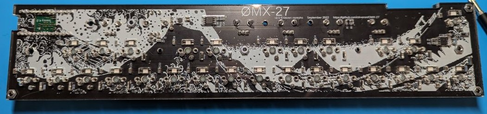
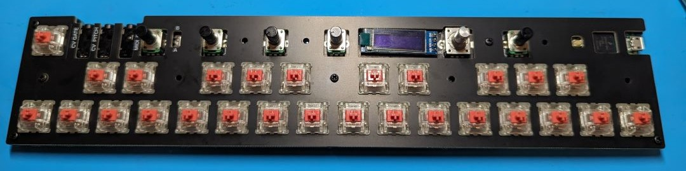
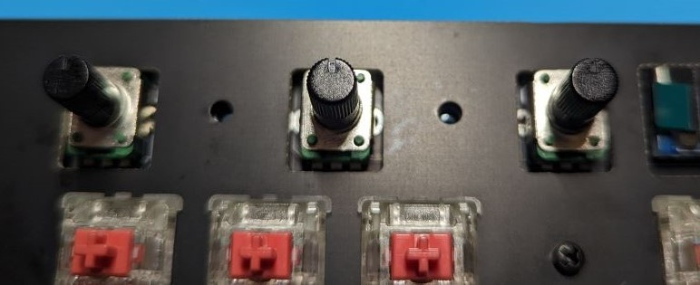
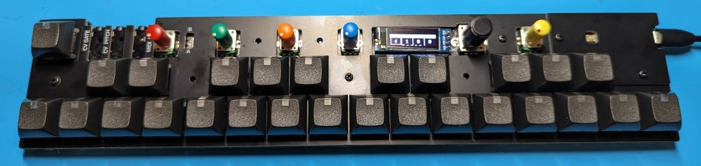

# OMX-27 version 3

### PLEASE READ THIS ENTIRE GUIDE FIRST

##  Before you start

### Notes / Reminders

- Kit PCBs have been flashed and tested. They should be fully functional. The microprocessor, LEDs, OLED, etc. are already assembled. Thru-hole soldering is required for the pots, encoder and switches.

- For the Cherry MX kit - the keyswitches are snapped into the keyplate first (before soldering them). 

- For the Choc kits - the keyplate fits over the switches and it can be attached later.  

- Don't forget to put the spacer layer(s) in-between the main PCB and the keyplate before you solder all the switches.

### Soldering Tips

I work with a fine point or chisel tip on my iron at 380C-400C. With this setup I typically hold the iron on a pad for about 2 seconds and then apply a bit of solder and then hold the iron there for anything 2-3 seconds. You want to watch for the solder to flow around the joint, but not to hold the iron there forever.

See [Adafruit's guide to excellent soldering](https://learn.adafruit.com/adafruit-guide-excellent-soldering) for lots of good tips and tricks.

# Build Video

[Build/assembly](https://www.youtube.com/watch?v=Nn4loqqdX9o) 

---

# Kit Build Instructions

The microprocessor, LEDs, OLED, etc. are already assembled. Thru-hole soldering is required for the pots, encoder and switches. 

## POTS AND ENCODER

Snap pots and encoders into place and solder.

You may need to gently squeeze the snap-in mounting pins together a tiny bit to get the pots to snap into place.

Note - You don't need loads of solder on the lugs - just enough to keep them in place.

---

## STOP HERE AND TEST

At this point you can do a quick test.  

Plug into USB power and the OLED should display the startup routine. Then the LEDs will light up in a "rainbow" pattern and the main screen will show on the display. Turn the encoder to the right to get to the second page and you can test each of the pots - which should show the CC number and value on the display.  

If you get random values for the CCs, you may need to check and reflow the solder on the potentiometer pins.

If the display does not light up or you don't see LEDs light up when you connect to USB power, double check the Power Switch on the right edge of the device. The "On" position is towards the USB port.

---

# Continue building

## Case Parts

__Carefully__ remove the paper backing from the acrylic base plate and set it aside.

If the brown paper backing material does not come off easily, you can often rub your finger along the surface to get the paper backing to "roll up" a bit 

Cherry MX kits have __two__ foam spacer layers. The Choc kit has __one__ foam spacer layer.

For the Cherry MX kit, you will need the PCB "keyplate" for the next step. For the Choc kit, set the keyplate aside until later.

## Key Switch Prep (MX Kit)

Check the orientation of the switches. The pins go towards the bottom-half and the LED window is at the top.  

Snap all the key-switches into the keyplate (from the top - keyplate top has text labels for the MIDI anc CV jacks). 

The switches may be a tight fit in the keyplate. Be sure they are snapped all the way into place.

Set the two black foam spacer layers on the main PCB and align it around the various components. Then set the keyplate with switches into place to be sure all the pins line up and everything is nice and flat. 

Inspect from the bottom that you have 2 pins sticking out for each switch. You may need to gently bend key-switch pins into place if they got slightly bent in transport.

Use the three of included case screws/nuts to fix everything together for soldering. I suggest using the holes down the middle of the case. This will ensure the key switches are held in place for soldering and that everything will remain flat.

## Key Switch Prep (Choc Kit)

Check the orientation of the switches. The pins go towards the bottom-half and the LED window at the top.  

Insert all the key-switches into the PCB.

## Switch Soldering

I suggest going thru and tack-soldering one pin for each switch (just enough solder to hold it in place). Then for each switch - use your not-soldering-iron hand to fully press each switch with your thumb on the bottom side, and re-heat the tacked solder joint. In some cases the swtich might not have been fully inserted and it will snap into place when you do this.

After all the switches look nice, make another pass and solder the other pin for each switch. Make a third pass and add a touch of solder if needed to the pins you tacked in place earlier.

## Assembly

Remove the screws/nuts if you used them earlier and then reassemble with the bottom plate.

The nuts fit into the captive cutouts on the bottom plate.

There are three longer screws which are used for the USB protector.

### USB Protector/Cover

Add the cover plate with the three remaining (longer) screws/nuts.

### Knobs

Push the knobs onto the pots, make sure the marking on the knob aligns with the marking on the pot. Be carefull not to press the knobs on too hard if you want to change them later. They can be difficult to remove if pressed on too hard.

### Keycaps

Then install the keycaps with the window on the top for the LEDs.

## MIDI test

You can use the [browser_test](../browser_test/index.html) script to show USB-MIDI input to your computer. Then you can check to be sure the pots are sending CCs and that you get MIDI note-ons/note-offs when you test each keyswitch's pads. Be sure you have the `oct` (octave) set to 4 on the display (change with encoder knob).

Also test the Hardware MIDI OUT 1/8" jack (with an appropriate adapter if needed) and a synth of your choice. Check the MIDI A/B switch position for your particular setup (try both to be sure you have the right one).

